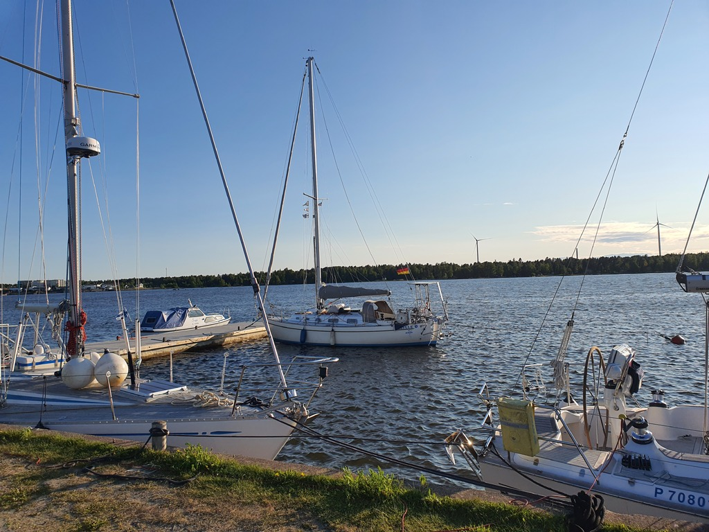

We held a boat maintenance day at Iso-Kraaseli, finishing some of the winter's leftover projects. Then early start for the slightly longer leg to the old tar capital of Kokkola.

Westerly winds in the morning meant motorsailing the Raahe fairway, as between the rocks and the traffic there was no space to tack. Once we turned to our course the waves got a little less intense and we were able to plug in the windvane.

 

Another leisurely day on beam reach. As we were following the coastline, there was internet the whole way, allowing for some office work.

We followed the really narrow and shallow fairway to the Kokkola Yacht Club harbour at Mustakari. Now there shall be sauna, some family visits, and a crew swap as Suski needs to do a business trip.

 

* Distance today: 63.5NM
* Total distance: 1308NM
* Engine hours: 1.3
* Lunch: oven feta pasta
