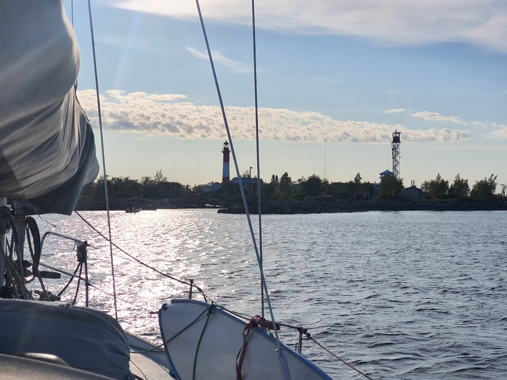

After provisioning and the crew swap, we headed out of the Kokkola Yacht Club under engine. Wind was directly on the nose, and the fairway too narrow to tack.

Once out in the wider part of the channel, the wind turned favourably, and we were able to pinch our way to the Tankar lighthouse island with just a single tack. A lovely short evening sail.

 

We're now on the island's guest dock. This could've ended poorly, as a fishing contest had booked all the guest spots. However, due to tomorrow's forecasted high winds the contest had been shortened. This means we can stay after all. What a pretty little island!

* Distance today: 9.8NM
* Total distance: 1317.8
* Engine hours: 1
* Lunch: fried rice
