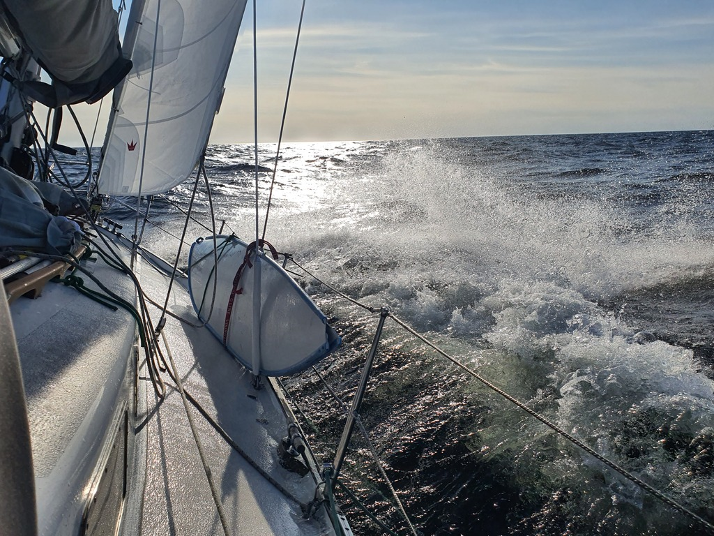

We decided to forgo the prospective salmon soup and go out sailing. Departure from Tankar was easy, and we hoisted the sails in the lee of the island. Interestingly, this was also the moment we measured the trip's highest wind at 29kt.

Luckily that gust was only a short anomaly and we could take long leisurely tacks out in the open water. Windvane was steering, and we mostly kept to a 55° wind angle to minimise the impact of the waves. Despite that, the boat was quite wet, with one wave managing to splash everything halfway up the mast!

Around sunset the wind started dying and as we would've needed to short tack the fairway to our destination, this is when we turned on the engine. A few more hours of sleep sounded promising after a full day beating into big waves.

Now we're in the protected small club harbour at Monäs. We picked a buoy at half past midnight (it still being quite light outside). We were told that the "owner of the buoy is at the Atlantic and so won't need it today".

* Distance today: 62.8NM
* Total distance: 1380.6NM
* Engine hours: 2.6
* Lunch: coconut lentil curry
