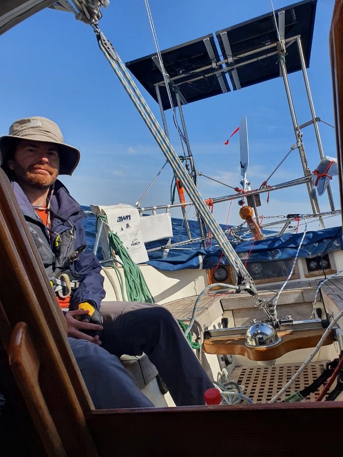
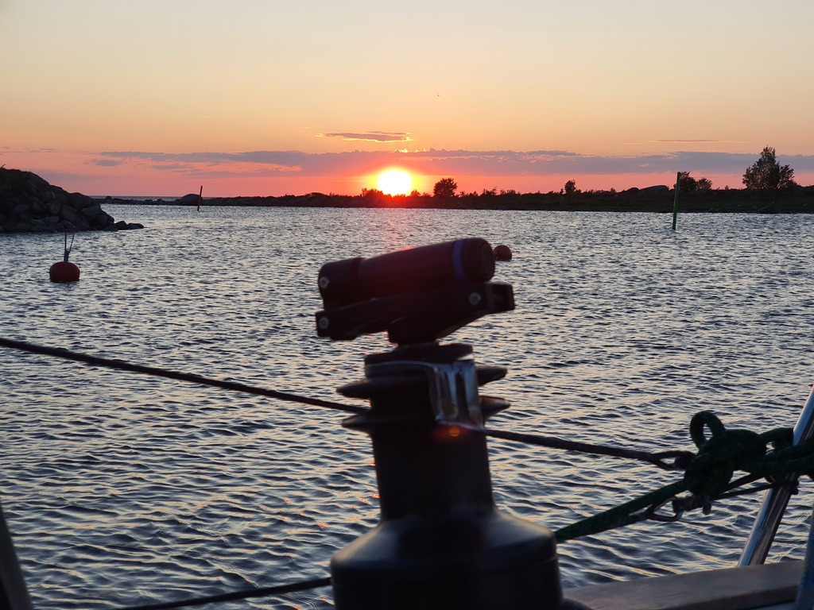

After a restful night we hoisted sail and headed west. Inspired by a humpback whale sighting in Finnish waters we picked the "Whale Islands" as our destination. The outermost islands on the Finnish side of the Kvarken world heritage area.

 

Like yesterday, today's theme was beating into big waves. As winds ranged from 13kt to 29kt, we got to do quite a few sail changes (genoa, staysail) and reefs on the way.

When we entered the channel between the Valassaaret islands, the waves disappeared completely, allowing for a nice docking manoeuvre. This island has a 19th century lighthouse built by the Eiffel company that would be interesting to explore tomorrow, assuming that the bird nesting season allows.

 

* Distance today: 47.3NM
* Total distance: 1427.9NM
* Engine hours: 0.5
* Lunch: spaghetti with tomato sauce
