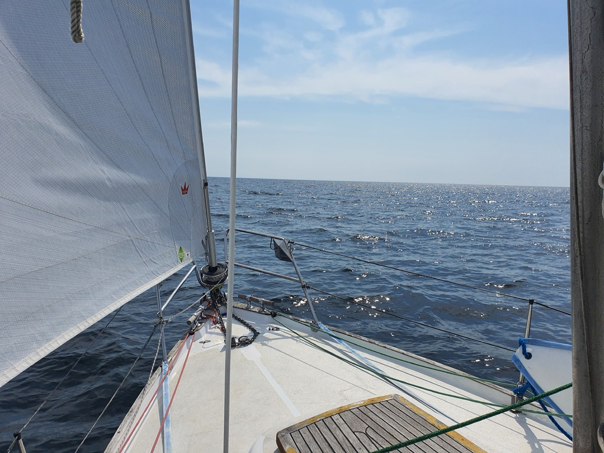
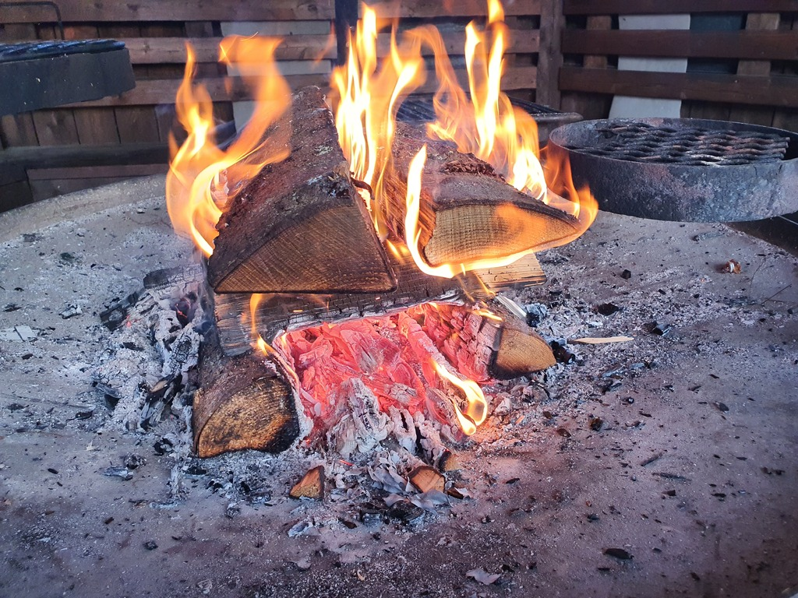

What a difference between two days! Today's sail was same tacking into the same wind direction. But with about 10kt less wind. This meant mostly smooth seas and pleasant progress.

 

Navigating the rocky Kvarken archipelago is not easy. You need to be sometimes ten miles off any visible land to have enough depth to sail freely.

As on other days, not a lot of traffic. We saw some of the Gulf of Bothnia shipping from afar, but no pleasure boats out here.

Now we're tied up to the Fäliskäret nature center's guest dock. As tomorrow there is forecasted to be a no wind day, we might stay here and try the sauna.

 

* Distance today: 43.7NM
* Total distance: 1471.6NM
* Engine hours: 1
* Breakfast: French omelette
* Dinner: grilled sausages
