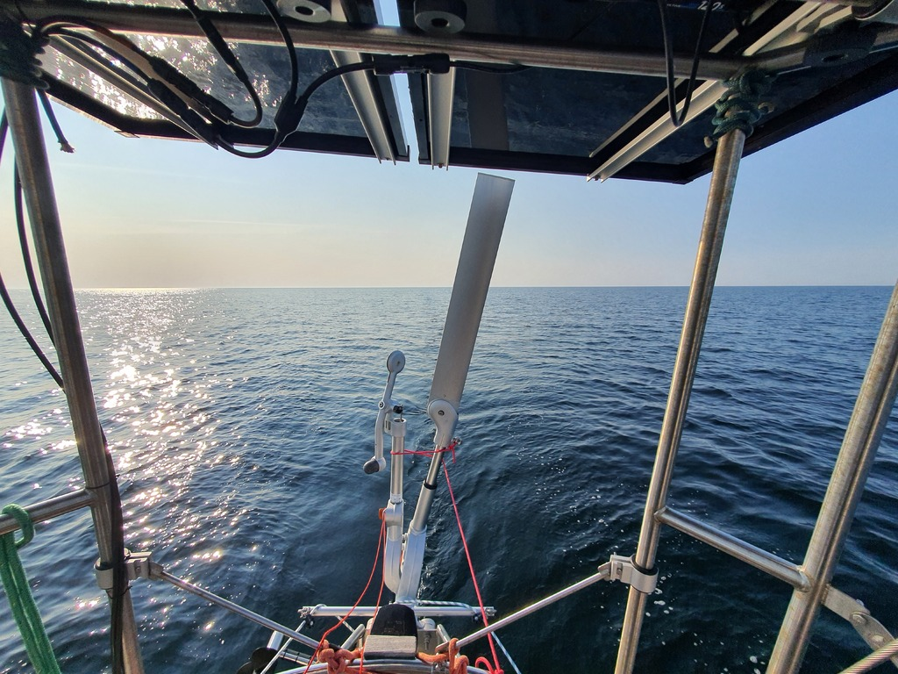
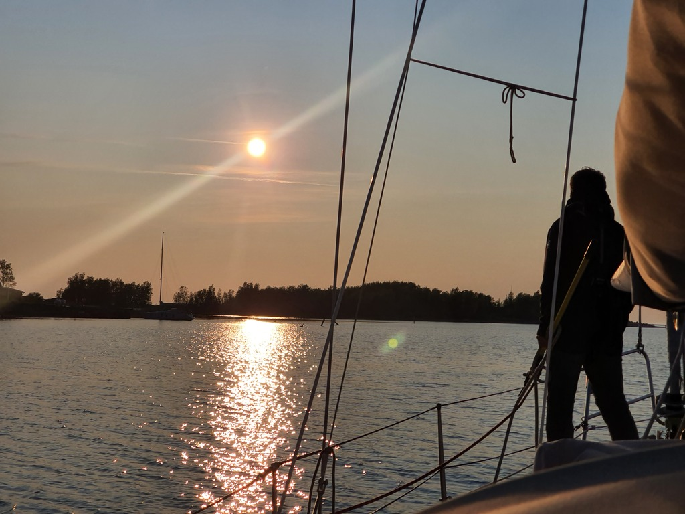

In the latest forecast the wind looked halfway sailable after all. We discussed possible harbour options with a local sailor, and then headed out.

In the morning we had to motor quite a bit to get to the open water. Then we got a nice leisurely sail on a close reach. As the wind was doing 40° turns, the windvane proved to be the right choice, as it could reach faster to wind shifts than our electric autopilot does.

Sailing in Kvarken is certainly interesting! Today we were following a fairway rated to 3m depth, while having basically no land in sight:

 

In the evening the wind died and we had to motor the last 8NM to our target. Now we're tied up to the Gåshällan visitor pier. And as I write this, the sauna is heating up.

 

* Distance today: 40.4NM
* Total distance: 1512NM
* Engine hours: 2.9
* Lunch: chanterelle risotto
