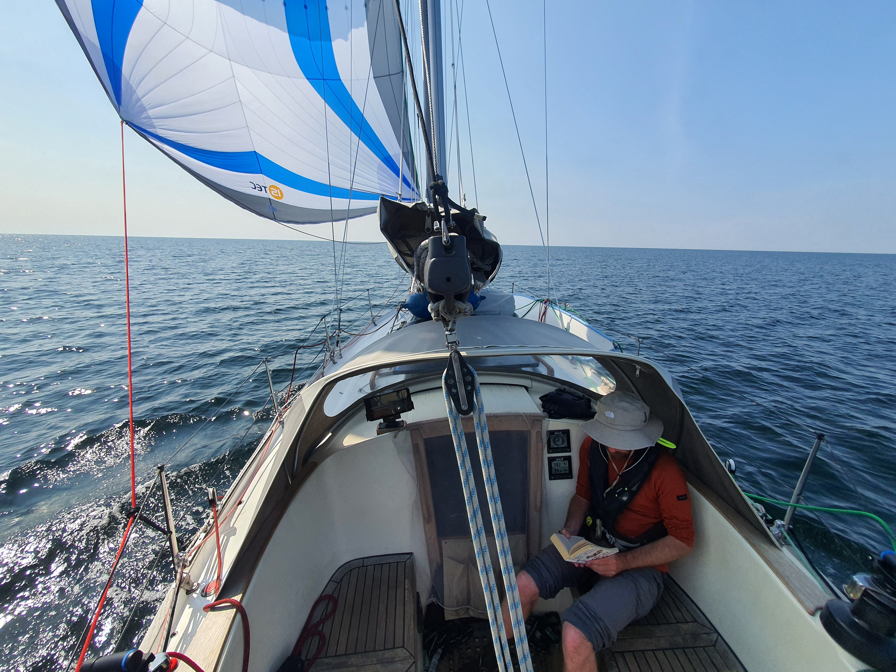

After a day of sauna and rest, the anticipated north wind finally arrived. This meant time for us to move on.

We motored the narrow fairway, and then rigged up the Parasailor. The whole day has been relaxed spinnaker sailing south at around 160° wind angle. Forecast has that continuing until morning, but we'll see.

 

This time the steering solution has been the electric autopilot in wind mode. Downwind the reaction speed isn't quite as essential, and the apparent wind has been too low for the windvane to steer well.

As on previous days, the sea has been empty apart from some distant AIS target. We've heard the murmur of engines from distance a few times, but haven't spotted anything bigger than a seagull.

Now we enter the watch schedule as the night approaches.

* Distance today: 57.9NM
* Lunch: couscous salad
