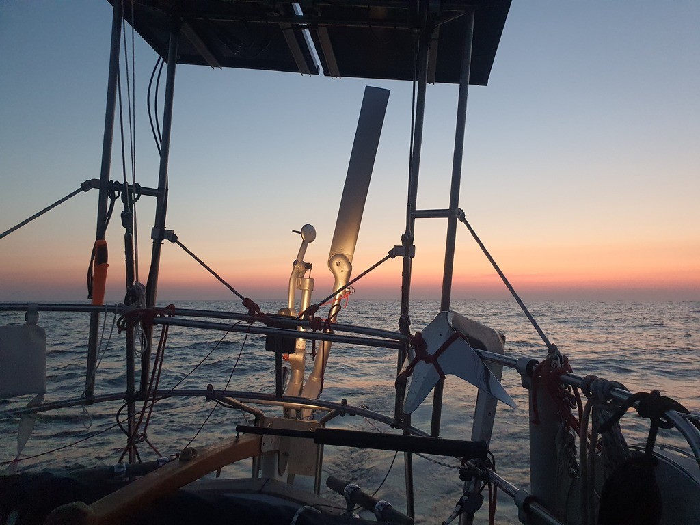
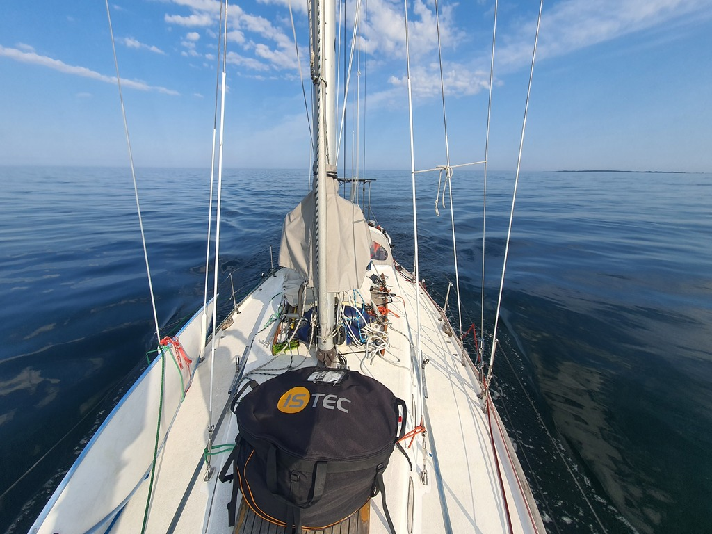

The night went quite uneventfully with a smooth Parasailor ride. Off-watches even managed to catch some shut-eye. I'm glad we got to experience a few of these "white nights" at sea before we're too far south. The picture below is from around the darkest hour of the night:

 

Sadly the spinnaker ride ended at sunrise, as the wind dropped drastically. We had to put the Parasailor back to its sock as it wouldn't stay filled in the swell with 4-5kt winds.

We were still pretty far offshore at that point, so not many options but to motor onwards. After all, we had a crew swap to make. And the new grib file didn't promise wind until the next day.

 

Entering the fairway to Uusikaupunki was quite a shock. After several months of spring, the real hot summer was turned on in an instant. Temperature was 15°C warmer than we'd seen on the trip so far, and there were more boats out than we'd seen in the whole last month. This is where the rush hour of the Archipelago Sea begins.

* Distance today: 64NM
* Total distance: 1633.9NM
* Engine hours: 6.6
