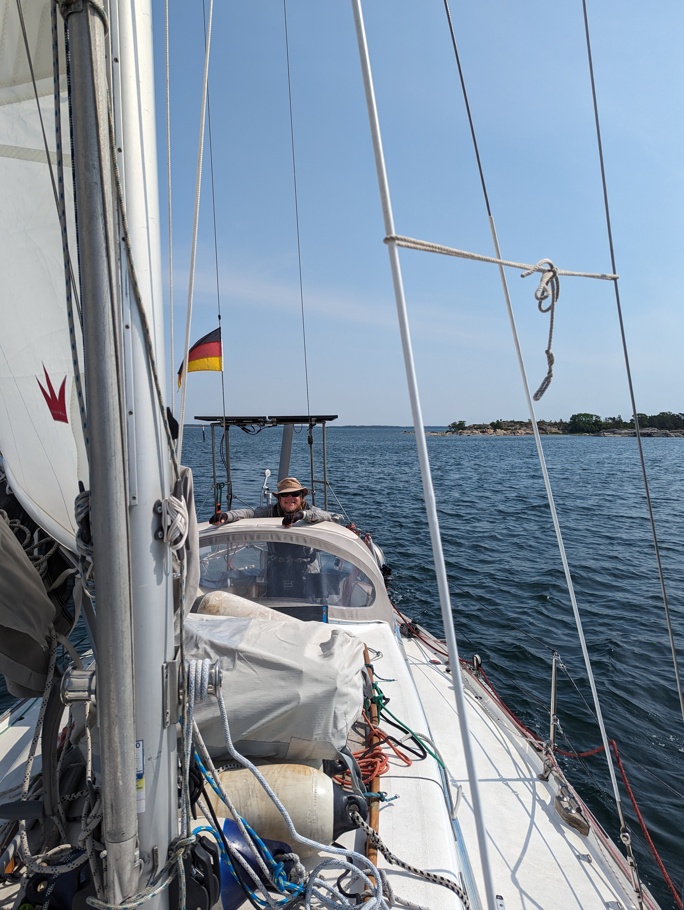

The morning started swiftly. Bernhard was left on the pier and we motored out to try and avoid the forecasted wind hole that was going to take over Uusikaupunki around midday. After the most narrow part of the fairway we hoisted the sails an headed south. 

 

We were flying ahead of the wind still so well that we eventually changed from genoa to staysail as the head winds and gusts up to 22kn were a bit much. Short sleeves and shorts have entered the sailing gear selection and it seems we can pack away the woolen shirts until August. At least we hope so. After a bit of tacking we decided to call it a day and headed to a harbour on the island of Iniö.
