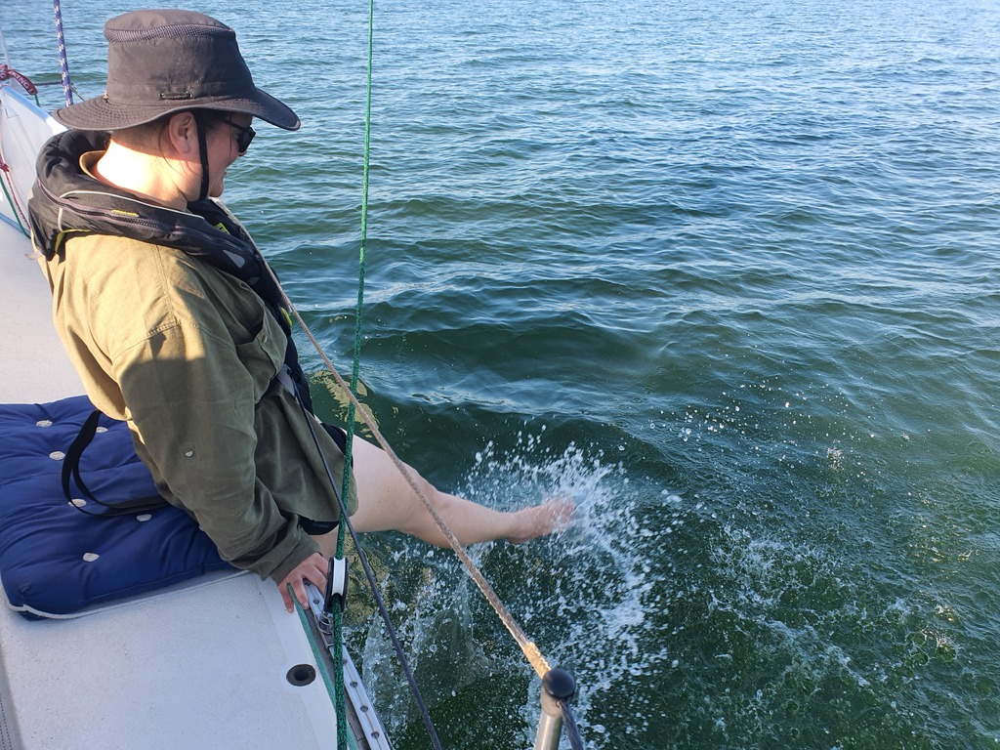
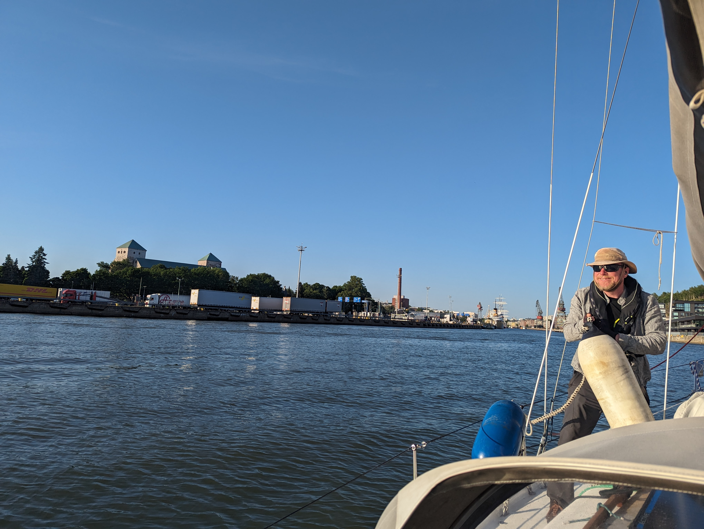

Light winds were in the forecast, and so we had a somewhat early departure for the leg to Turku. Lovely sunny weather, and tacking in light winds among a beautiful archipelago - not bad at all!

 

There were some other boats out and about. During a calm, we managed to even have a conversation with a German boat headed the other way.

Once we reached Airisto, the wind turned and we were able to cross most of it wing-on-wing. Then eventually the wind finally died and we had to drop the sails and motor the last eight miles.

 

Now we're again tied up in the Turku City Marina, right in the middle of the city. Now some family time.

* Distance today: 39.7NM
* Total distance: 1716.8NM
* Engine hours: 1.9
* Lunch: spaghetti with avocado sauce
