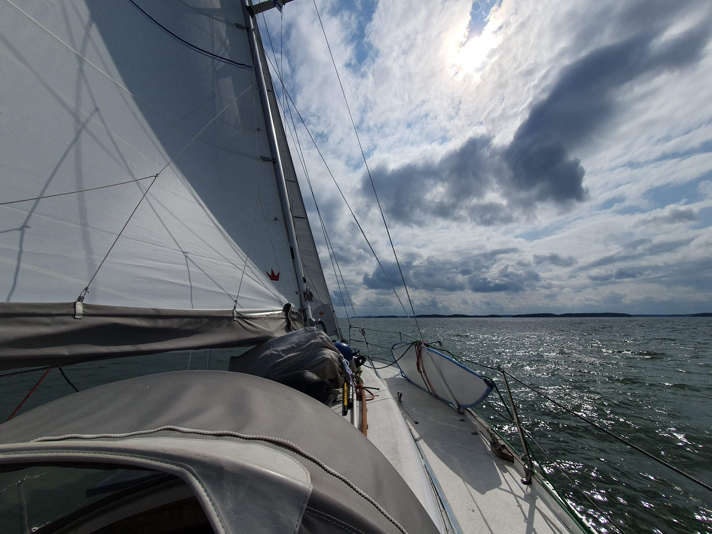
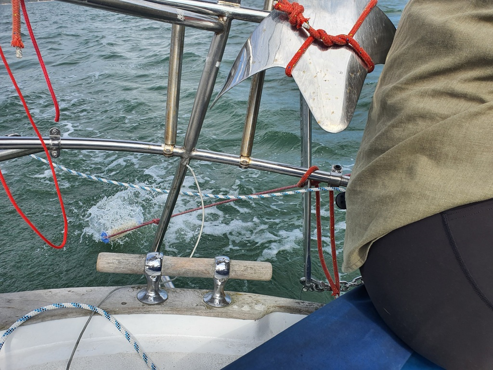
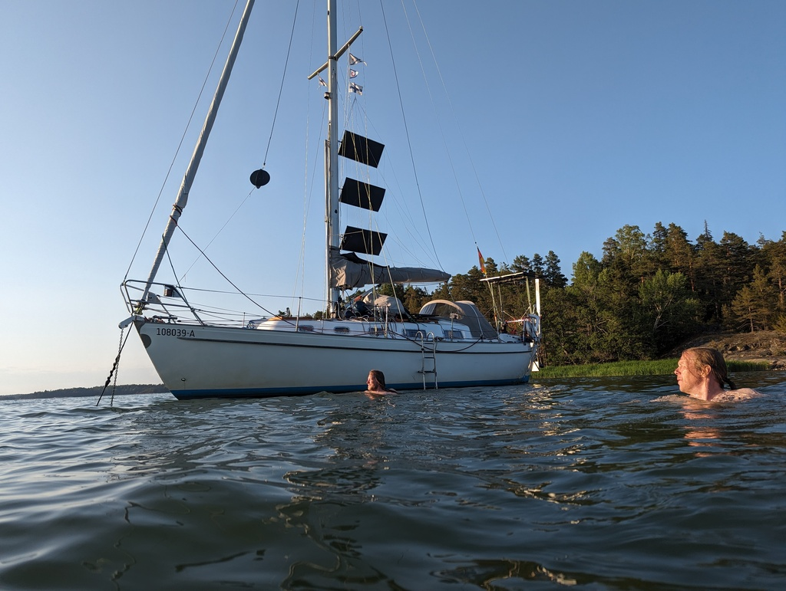

For the Midsummer weekend we got the opportunity to sail with our friend Skoll so the day started the minute he got on board in Turku. Engine on and we backed out of the harbour. The river and fairway were too narrow to tack, so we motored to the start of Airisto, a deep and wide part of sea in the Turku archipelago. There we hoisted the sails and headed south. 

 

On the Airisto we started maintenance for our watermaker, rinsed the filter (by dragging it behind the boat) and reassembled it back. We also tightened some of the hose connections to remove some of the air bubble issues that we have been having. The maintenance was successful and we finally got the output we expect. Before the water had been too cold and the tiny air leaks have not helped. 

 

Between Parainen and Nauvo the wind started dying and near our anchorage it completely stopped. We glided in to the anchorage and now we are enjoying the evening sun and are about to go for a swim!

 

* Distance today: 19.9NM
* Total distance: 1736.7NM
* Engine hours: 1.3
* Lunch: hamburgers
