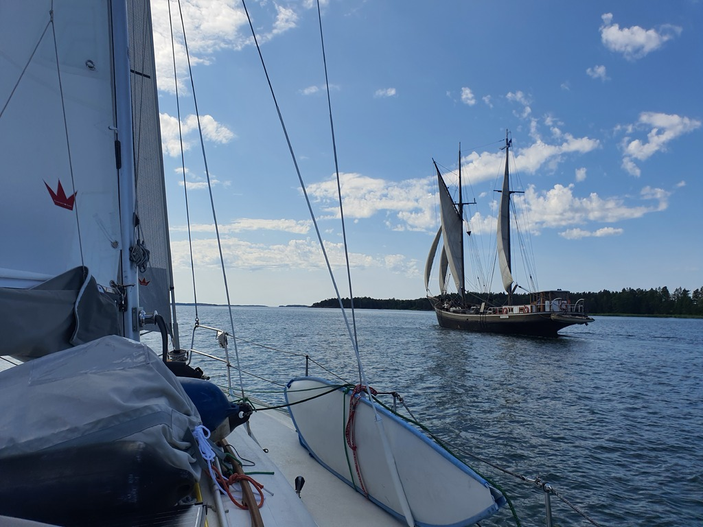

The wind turned northwesterly during the night, fitting our plan of sailing south east quite well. After we had cleared the mudball anchor, we sailed out to the fairway accompanied by a classic wooden galleass.

 

When we passed the island of Helsingholmen we spotted a free space in the marina. This meant a quick ice cream stop, as well as procuring some of their excellent smoked salmon. Then on with the lovely downwind sail.

 

Passing Kasnäs we fitted our cockpit table and had a proper Juhannus lunch underway. Lots of traffic around, but it was easy to deal with the autopilot. Lots of boats were dressed with signal flags or with traditional Juhannus birch branches.

 

After Hiittinen we turned into a secluded natural harbour where we're now Scandinavian moored.

* Distance today: 28.6NM
* Total distance: 1765.3NM
* Engine hours: 0.8
* Lunch: new potatoes and smoked salmon
