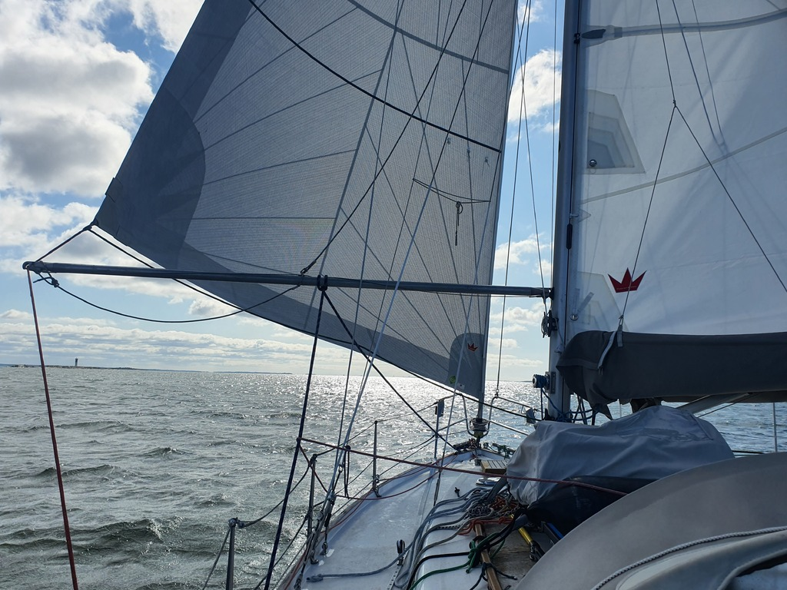

We hoisted the anchor after a morning coffee, and headed towards Hanko on a swift downwind run. As the sun was behind the sails we made some power with the hydrogenerator.

 

The weaving fairway meant having to do a few gybes, including moving the spinnaker pole. We arrived to the Hanko fuel dock just after noon and filled up the diesel tank.

 

Suski left the boat to go to a party, and we continued our sail east with Skoll. At Byxholmen we saw a free buoy that we tied to. It is a bit windy here, but not enough fetch to build proper waves. Sauna is booked for the evening.
Let's see how rowdy the Juhannus is here.

* Distance today: 29.5NM
* Total distance: 1794.8NM
* Engine hours: 1
* Lunch: chanterelle risotto
