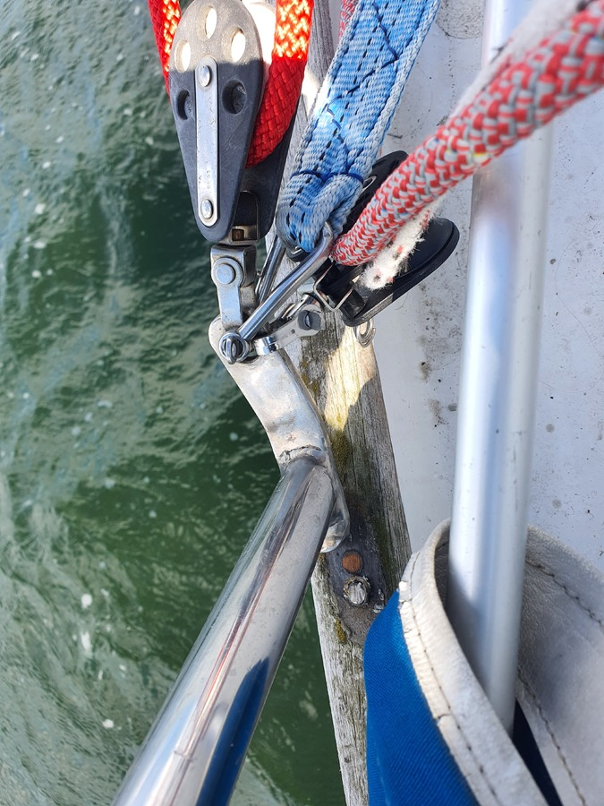

After a fun sauna evening, we set ourselves an early alarm for a departure. Unlike forecasted, in the morning there was a wind hole over the Tammisaari archipelago. So, we prepared the Parasailor and motored on.

There had been a couple of false starts earlier, but passing Jussarö we finally caught the wind and were able to start sailing for real. As the wind became more solid, we discarded out bailout harbours and turned to the narrow winding fairway towards Porkkala.

 

When we reached open water, the going became really smooth. A small swell, some 10-14kt of wind, sunshine and a full spinnaker. Quite lovely. Then...

 

A bolt holding our stern pushpit sheared with a bang. This is the place where the spinnaker sheet block attaches to. Hence, first priority was to get the spinnaker down as quickly as possible. Then hoist the mainsail to maintain steerage. To top it off, a thunderstorm was developing in the horizon, and so we decided to cautiously go first reef.

This means a bit of a rocky ride, as we were undercanvassed for the circumstances. But, better safe than sorry. In the end, the thunderstorm went past us with only a bit of a drizzle. Since both our windvane and the electronic autopilot are held by the pushpit, we also had to hand steer.

 

We eventually dropped sail and arrived to the Lähteelä harbour where we had the planned crew change, as Suski was back from the party. Now we'll have to fix the pushpit before we can head offshore again.

* Distance today: 35.9NM
* Total distance: 1830.7NM
* Engine hours: 2
* Lunch: steak and salad
