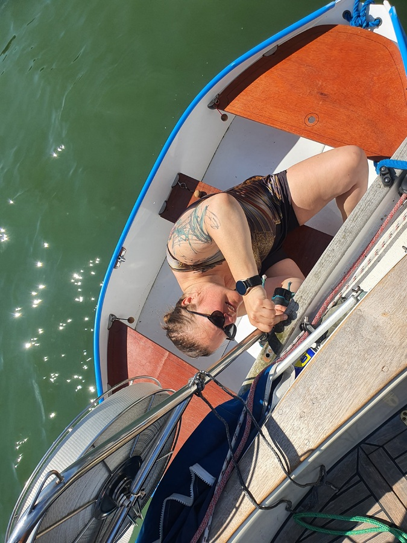
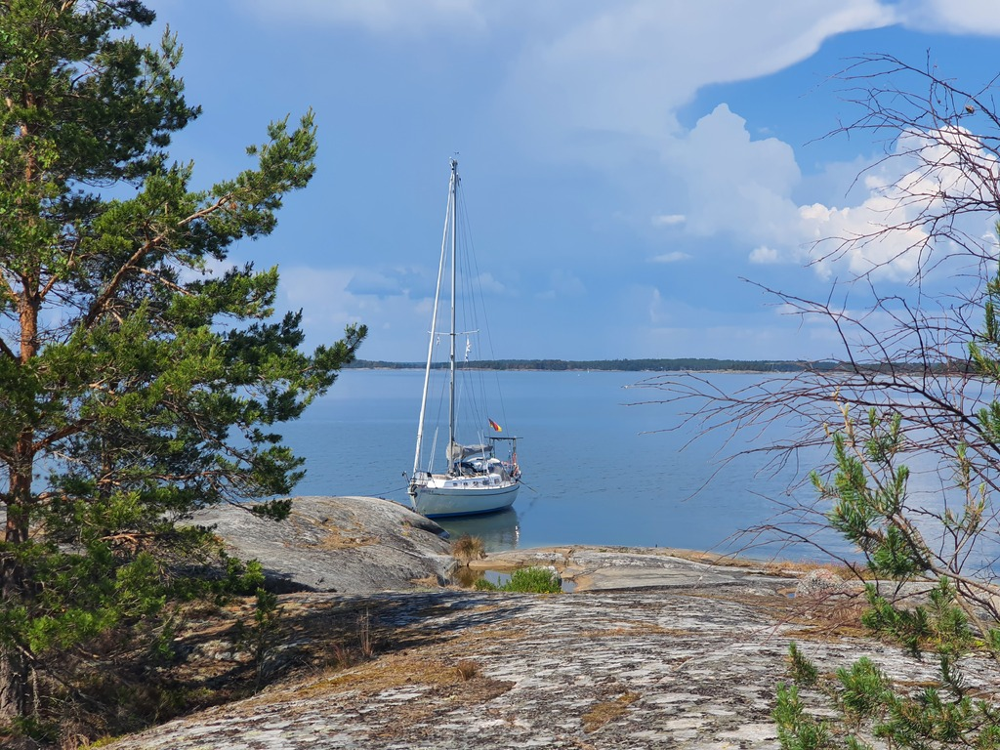
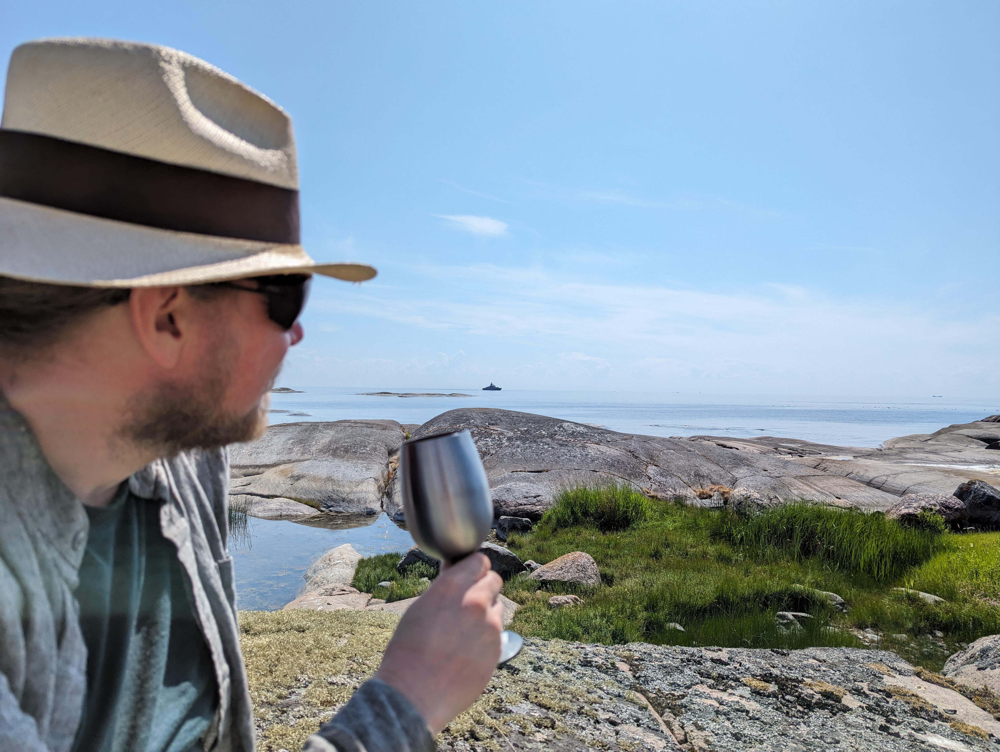

The pushpit repairs required a visit to the hardware store. As Lähteelä has only 3 daily buses, some additional help was mustered. Suski's parents drove to help us and to enjoy some crepes made on the fire. We got all the required parts and after that it was luckily a simple process to attach the pushpit back to the boat. 

 

As the boat was again in a sailable condition, we proceeded to motor to the next location as there is no wind whatsoever. This also meant that we could visit a new to us island on the outer edge of cape Porkkala, this is definitely a nice weather stop. 

 

We checked the sea scout information and did a careful approach. A nearby motorboater gave us additional info, and we found the mooring rings in the rock. Now we are enjoying a picnic on the "wind" side of the island looking towards open sea once again.

A cyanobacteria bloom has appeared overnight, severely limiting our swimming and watermaking options.
