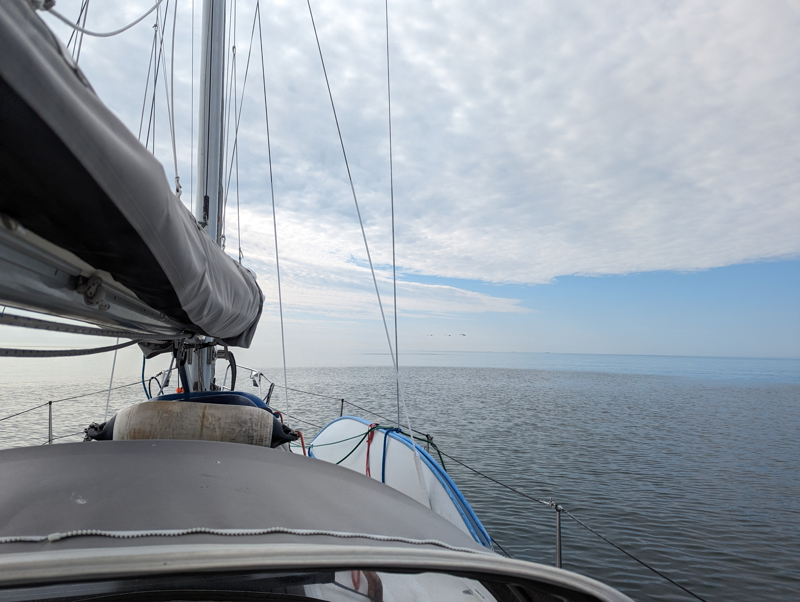
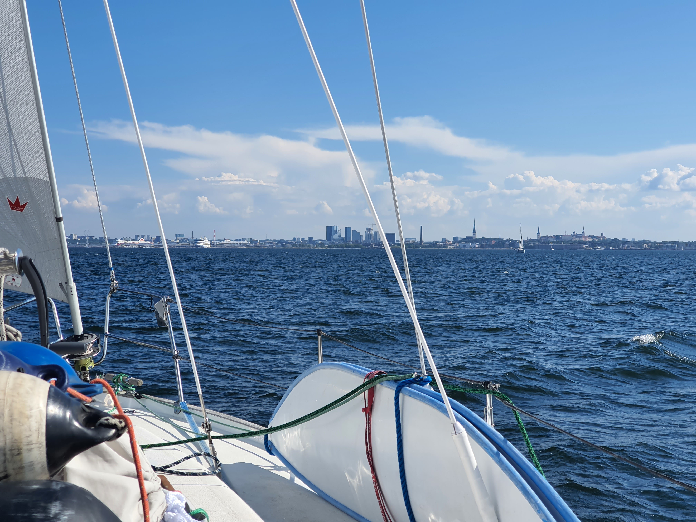
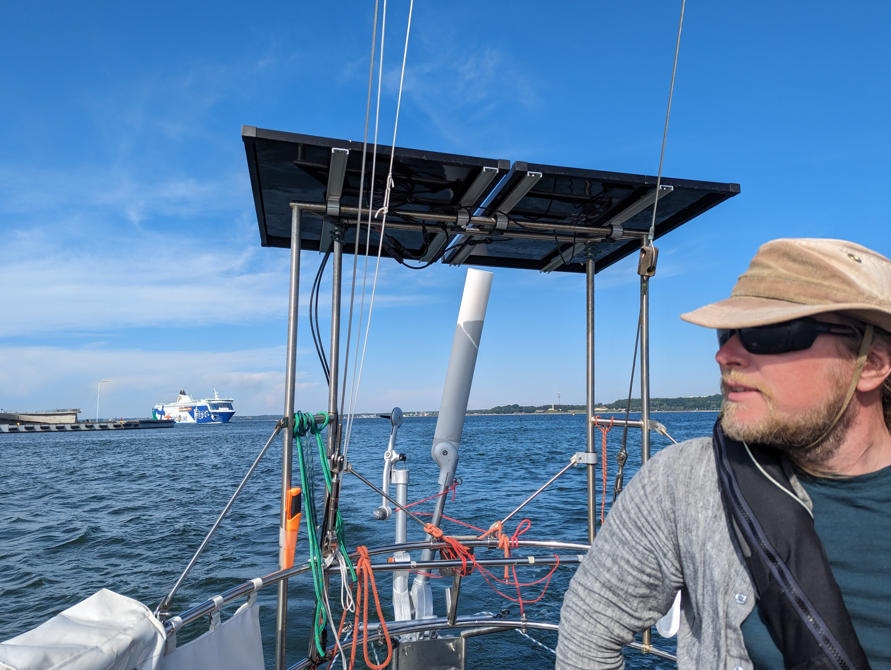

The morning started with very mild winds, 1.6 knots meant that we decided to sleep for one more hour. On the second try the wind was a whopping 4 knots, enough for us to sail with!  We motored out past the last underwater rocks and hoisted the sails. Glassy calm waters with wind just enough to fill the sails, we don't require more. Our chartplotter app estimated our arrival to be well after midnight, at least we would be there well after all the big ferries! 

 

Along the way wind turned and picked up a bit, and our estimated arrival was earlier and earlier. So much earlier that we started checking the arrival and departure times of the big ferries. The Old Town harbour is located behind the big ferry terminals, so timing is of an essence. 

 

Arriving to the bay of Tallinn, the wind picked up, the highest gusts were over 20 knots when before that we had only seen half of that. "Manöverböe" we sighed and rolled in the genoa.

At 1NM distance we turned on the engine, dropped the main and called Tallinn Radio 5 to ask for permission enter the harbour area. Permission was granted with the remark "you have 30 minutes to be on the turn bridge and there is Eckerö Line behind you, stay on port and keep your speed". So we hit the gas lever to the floor and cleared ourselves from the big ships area and were on time for the bridge opening. After us the bridge would close for an hour as the disembarking passangers need an unobstructed way to the city.

 

Now it is time to find some food, fill the bilge and enjoy the sunny Medieval town!

* Distance today: 32NM
* Total distance: 1867.8NM
* Engine hours: 1.4
* Lunch: pea soup
