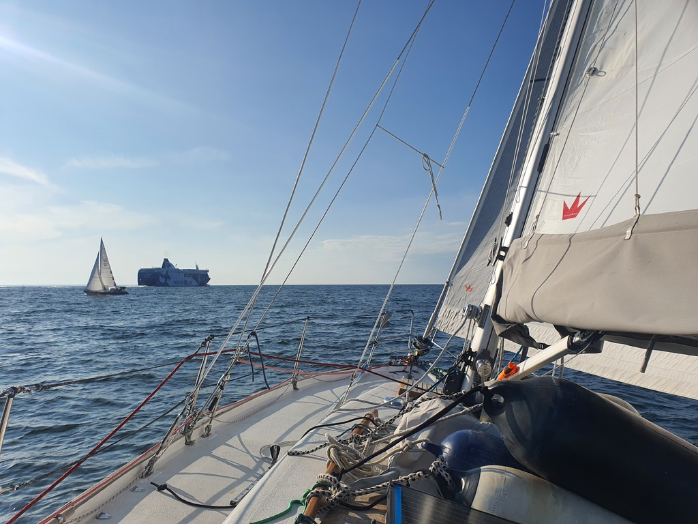

That was another efficient Tallinn stop. In 24h we had a Medieval feast in Olde Hansa, visited the Lennusadam maritime museum, did some provisioning, and even managed a surprise family visit. Then back to Finland as the weather window looked good!

We contacted the Tallinn Radio over VHF before starting engine. Advise was that there would be a about 20 minute wait due to ferry traffic. With that, we moved the boat to the waiting pier in front of the turning bridge. There we got advised of further delay. Finally about an hour of the initial contact we were under way. Out of the wave break, and sails up.

 

Soon we were beating alongside the Tallinn traffic separation scheme on a close reach, with windvane steering. As we advanced, the close reach turned into a beam reach, then broad reach. Cyanobacteria had dissipated, and we were able to make a bit of water.

 

We tried going a bit further east dead downwind wing on wing, but the waves and the low wind didn't quite cooperate. So instead we turned the bow towards Helsinki and crossed the main traffic of the Gulf of Finland. Then closer to coast the wing on wing finally worked, and we rejoined our planned route at sunrise.

Now we're tucked away in the extremely protected lagoon of Bockhamn near Loviisa. There is quite a bit of weather in the forecast, and hence we'll stay here likely until Wednesday.

* Distance today: 72.5NM
* Total distance: 1940.3NM
* Engine hours: 2.1
* Dinner: flammkuchen
* Midnight snack: cheese and vegetable wraps
