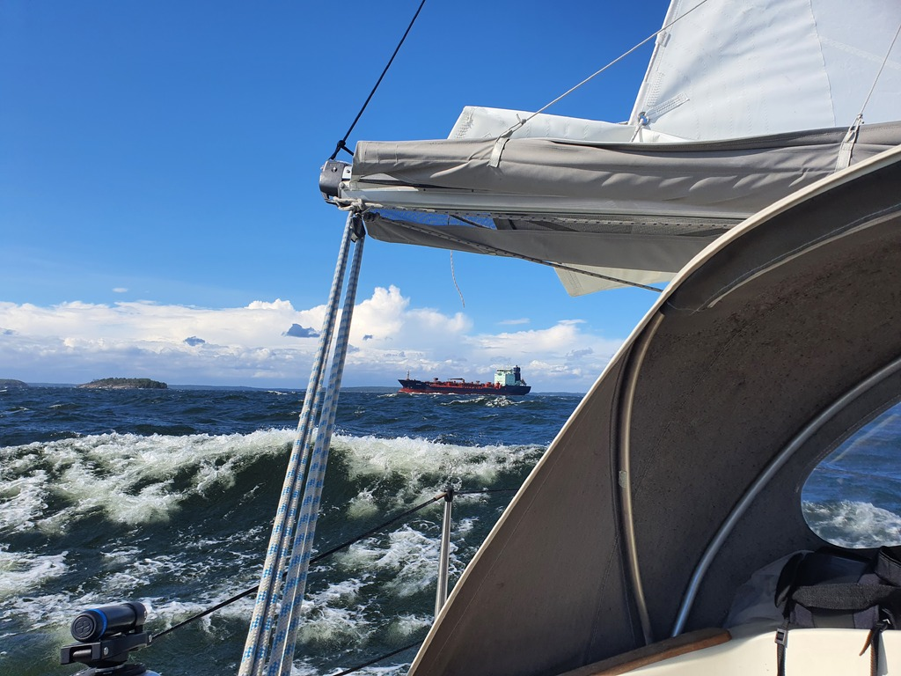

The nature harbour of Bockhamn was indeed quite protected. For the past few days, it was blowing 30-40kt outside with 2-3m waves. We were sitting happily in our quiet pond, seeing 5kt or less of wind, reading and occasionally grilling. I feel sorry for the couple of sailboats that had to leave in the middle of it to go to a marina to charge batteries!

Today we decided to sail on, utilizing the favourable wind direction at the coattails of the storm. Since high winds were still in the menu, we took the cautious approach of starting the day with the main on second reef and the staysail.

 

Early on, this felt a bit overcautious, as we were making somewhat slow progress in ~15kt winds, following the winding fairway between the skerries. But as we passed Loviisa, the wind started filling in. After that we were mostly blasting along at hull speed wing on wing, and seeing gusts up to 34kt. At that point we were quite glad of our selected sail plan!

 

As we passed the normally busy port town of Kotka, the only other boats braving the weather were the local Optimist dinghy kids.

Now we're in the old bastion fortress city of Hamina near the Finnish eastern border. We'll do some provisioning and visit the local museums before returning to the archipelago.

* Distance today: 43.6NM
* Total distance: 1983.9NM
* Lunch: oven feta pasta
