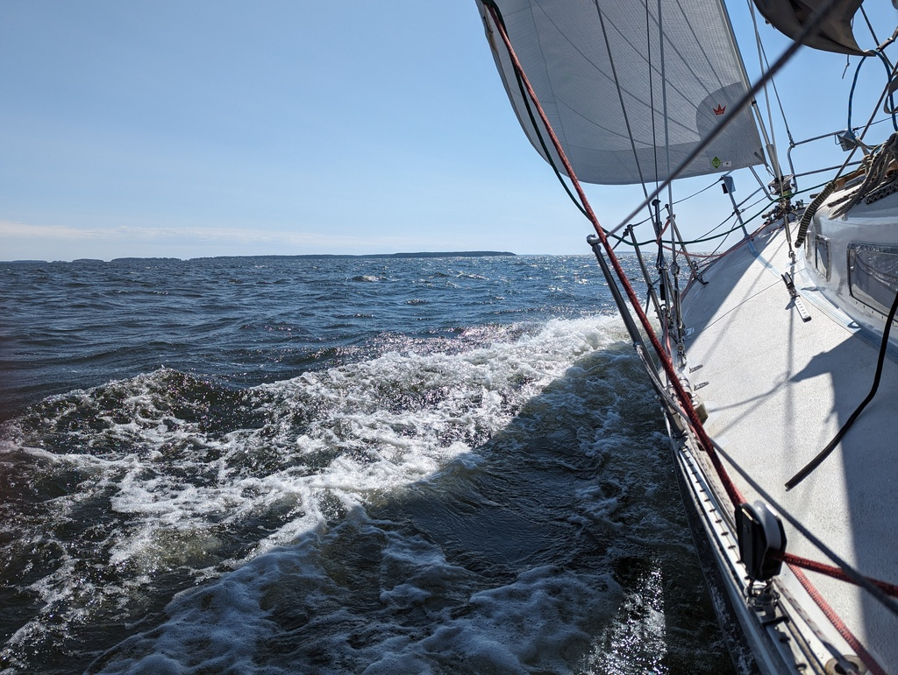

We spent a lovely day off visiting Hamina's various museums with the expert guidance by Paula. The tour ranged from nautical oddities to the bastion fortress, one of the 2 surviving star fortress towns. In Shopkeeper's Museum we learned that no, the past was not a better place! 

The sailing day started with only a gentle breeze. We pulled up the sails right outside of the harbour. The winds along the route ranged from headwinds to beam reach and from the morning's light winds we ended up with a steady 20 knots on the beam. 

 

After only 3 hours we were at our destination, Ulko-Tammio. This was an island fortress during the second world war. From here it is only 4.7 nautical miles to Russia, so for once our network connectivity is bad. The small pier is packed full and we side tied to the ferry spot as it had already done the daily visit and we wilö be gone before it arrives at noon tomorrow. It's going to get even busier here tonight as there is a outing for a local motor boat club.

* Distance today: 15.7NM
* Total distance: 1999.6NM
* Engine hours: 0.5
* Lunch today: grilled sausage and salad
