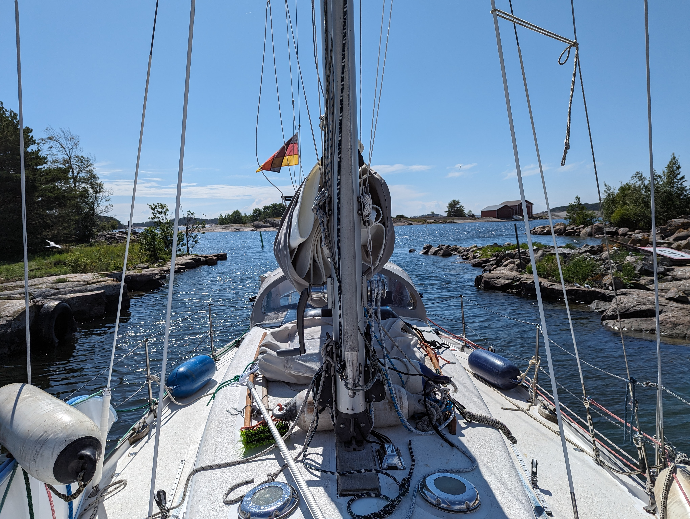
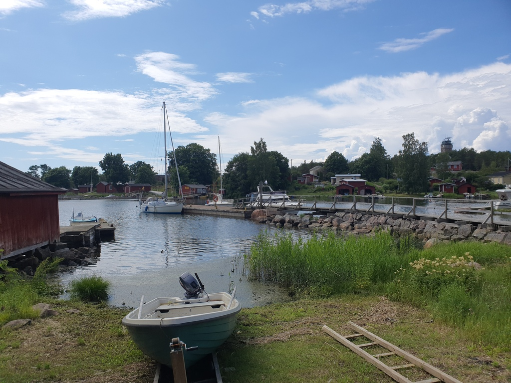

We left Ulko-Tammio after breakfast, in order to avoid the incoming ferry whose place we were squatting. To complete our list of seen Finnish sea weather reporting stations, we planned an upwind route to the island of Haapasaari.

What followed was a quite comfortable beat in light winds and smallish seas. In just couple of hours we had reached the island of Haapasaari (old name: "Perkele Skerry", for its treacherousness).

 

We dropped sails in the lee of the island, and then motored into the old village harbour. Beautiful place, but quite "interesting" entrance!

 

* Distance today: 13.8NM
* Total distance: 2013.4NM
* Engine hours: 0.5
* Lunch: couscous salad
