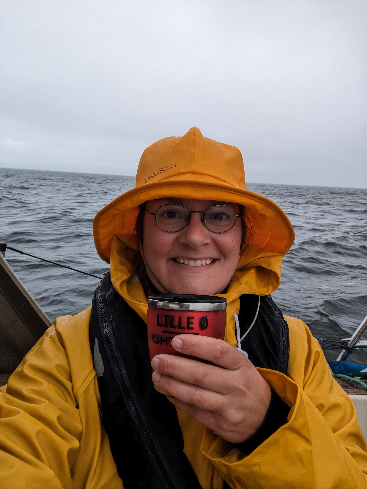
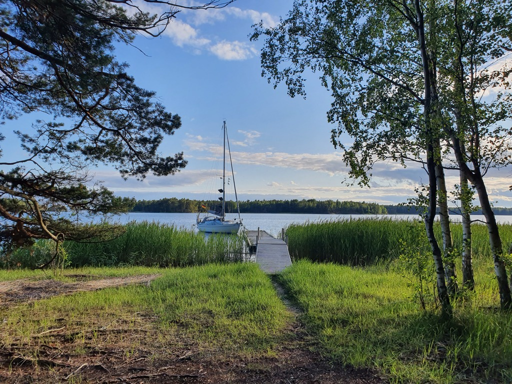

We started the day after what we thought would be the last rain cloud. We carefully reversed out of the pier and turned our nose towards the narrow entrance. At the coast guard station we needed to do some manouvering around the coast guard vessel, they had some guys in a motorboat in tow. After passing the duo, we raised the sails and headed on the outside route. 

The wind never came from the expected wind direction and the confused seas and flogging sails meant a change of plan. Instead of dead down wind we took up a beam reach and scooted back to the inner fairway. Suski was on duty when the rain or better, very thick air, came through. No indication in any of the radar images, but wet it was. 

 

Eventually the wind died completely and the last 7nm  was spent motoring towards destination, a Uuvi pier in a protected bay with a fireplace and couple of mooring balls.

 

* Distance today: 40NM
* Total distance: 2053.4NM
* Engine hours: 1.8
* Lunch: spaghetti bolognese
