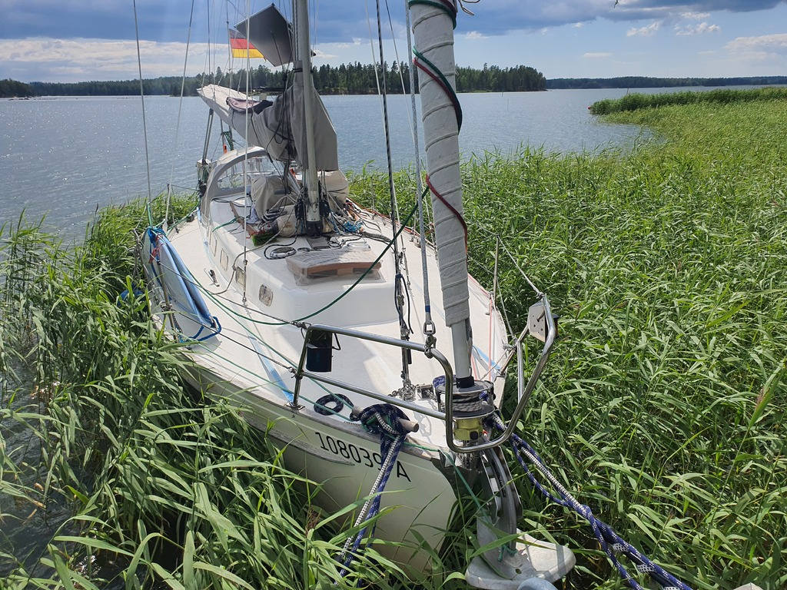

We celebrated the nice sunny morning by making breakfast and coffee on the fire on shore. Then we detached from the buoy and motored the short hop around the island to our destination.

We're stern anchored on the pier of a friend's summer cottage. The boat is hugged very closely by the reeds. So closely in fact that our motor was only just strong enough to push us to the pier. We had to do the last two meters by ropes.

 

Now starts a week of sauna, hot tub, and board games!

* Distance today: 5NM
* Total distance: 2058.4NM
* Engine hours: 1.4
* Lunch: fried egg rice with vegetables
