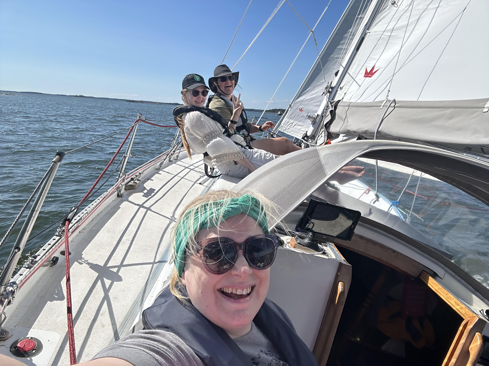

As the winds were a perfect 10 to 15 knots we decided to go for a day sail. We had a crew of 7, so it was time to leave all fenders and extra sails on shore to have the maximum of deck space for the whole troop of sailors on board. We went around the close by islands, so we got a bit of everything. Tacking, beam reach and downwind sailing. 

 

* Distance today: 15 NM
* Total distance: 2063.4 NM
* Engine hours: 0.4 NM
