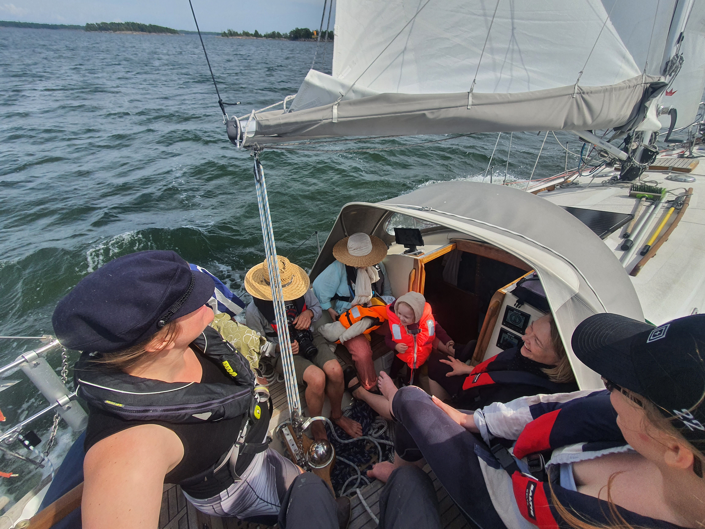

Another nice wind day, and hence another group of happy sailors taken out for a trip around the nearby islands. This time we had some toddlers on board, so we elected for a staysail and the first reef.

 

Happily the algae situation has cleared up, so we were also able to make some water. Now we need to monitor the seawater levels, as the pier we're tied up to has silted since last year, and we only have a few centimetres of water under the keel.

* Distance today: 14.9NM
* Total distance: 2078.3NM
* Engine hours: 1.8
