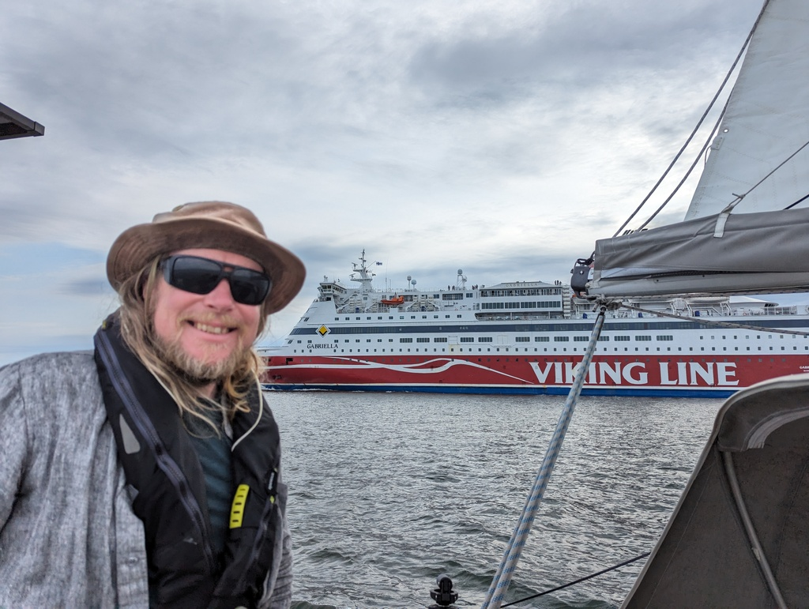

A favourable east wind was in the forecast, and so we left the protected lagoon of Bockhamn and hoisted sails. In the shelter of the islands the winds were light, but still enough to sail. Just like last year, wind filled in after we passed Pellinki.

As we had stronger winds this time, we stuck to the outer fairway. The waves built up, but that wasn't a big deal until almost the very end when the incoming rain front killed the wind.

 

With some tweaks, we were able to sail into the city. Going through the narrow Kuninkaansalmi strait was exciting as always, as well as dealing with the busy Helsinki harbour traffic. Now we'll stay here for a couple of days to avoid a gale, do some logistics, and meet a bunch of friends.

 

* Distance today: 35.5NM
* Total distance: 2116.9NM
* Engine hours: 0.3
* Lunch: macaroni with pesto and cheese
