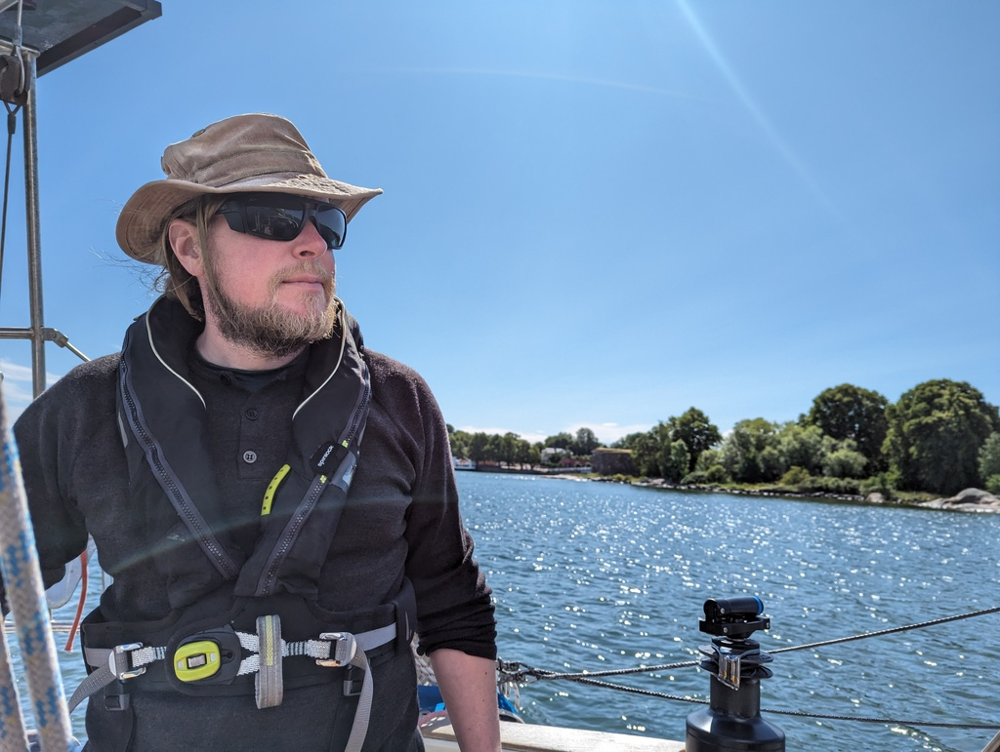
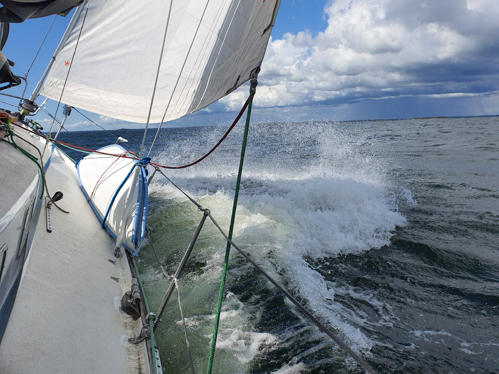

Last round of provisioning, filling the water tank and emptying the toilet was done before setting sail out of Helsinki. We tacked the whole way in the narrow fairways and busy Helsinki traffic. Both of us were needed to keep track of all the different markers and boats. 

 

Once outside we got to enjoy a bit longer tacks, but today was a proper workout day. We found a free stern buoy and tied ourselves in. We will stay here for a while to sort out a family emergency.

 

 * Distance today: 13.2 NM
 * Total distance: 2130.1 NM
 * Engine hours: 0.5
 * Lunch: pea soup
