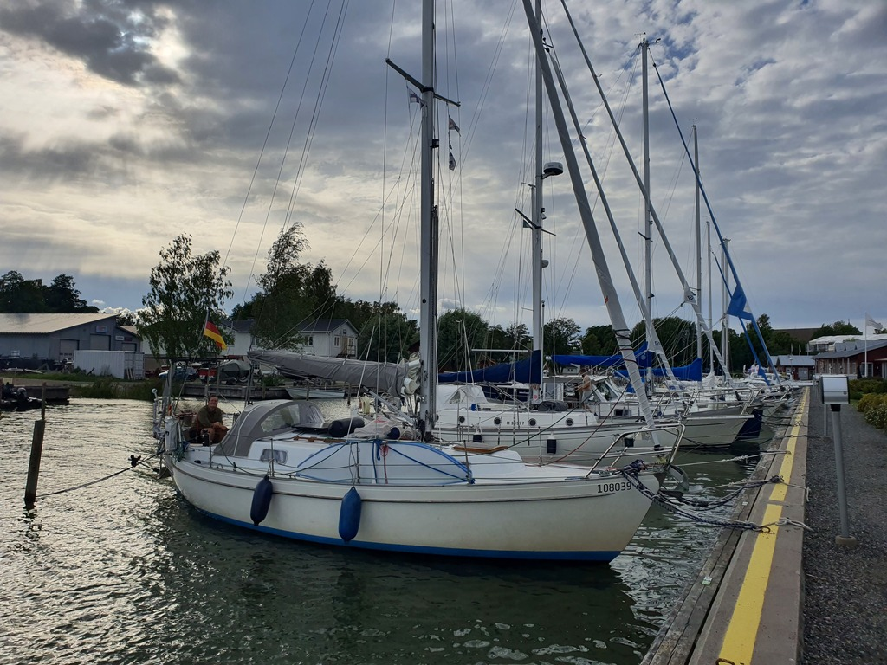

The well on Gåsgrundet had run dry already earlier in the summer, and so our watermaker got into good use supplying the sauna.
After a week of "island time", Suski was back for a couple of days. It was time to move somewhere more reachable by public transport.

 

Light winds right on the nose meant tacking our way along Cape Porkkala. Sometimes very short tacks, sometimes more leisurely long stretches. Everybody and their dog was coming back from the Archipelago Sea, and so there were lots of boats going wing on wing or with a spinnaker to dodge.

The pleasant conditions continued on the open water part. Some 10kt of wind and quite light swell that disappeared when we entered the inner archipelago again.

 

Now we're tied up in the guest harbour of Inkoo, one of the small medieval coastal towns here. We went by a few times last year but didn't stop, so time to remedy that.

* Distance today: 33.5NM
* Total distance: 2163.6NM
* Engine hours: 0.5
* Lunch: chanterelle pie
