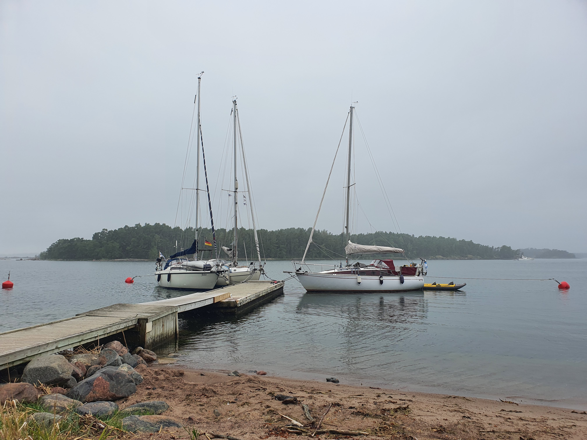

The rainy morning turned into a sweaty day. We motored with the non-existent winds to the nearest UUVI island. As we approached we saw a fully packed pier with boats already sharing the stern mooring balls. So we approached slowly and asked if the sailboat in the last mooring ball was willing to share theirs and they did. So we did a second approach towards that buoy. With a fully extended hook we caught the buoy and managed to avoid the stern of the sailboat. I was glad I could throw the first line to a fellow sailor on the pier as double parking a buoy was enough stress not to worry about stepping to the pier on the correct moment. 

 

We are now tied up in here enjoying the island and its beaches.

* Distance today: 3.6NM
* Total distance: 2167.2NM
* Lunch: crepes with vegetables
