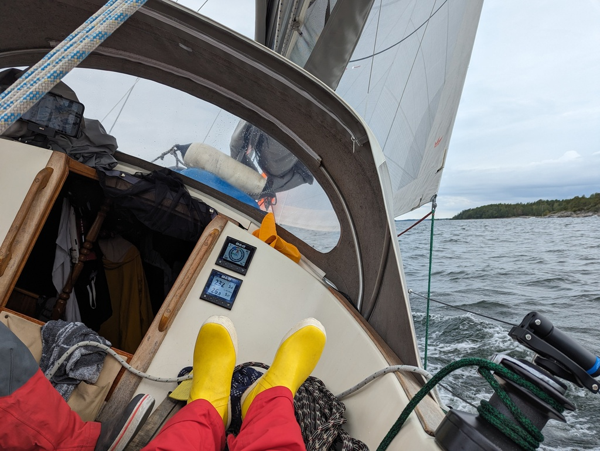
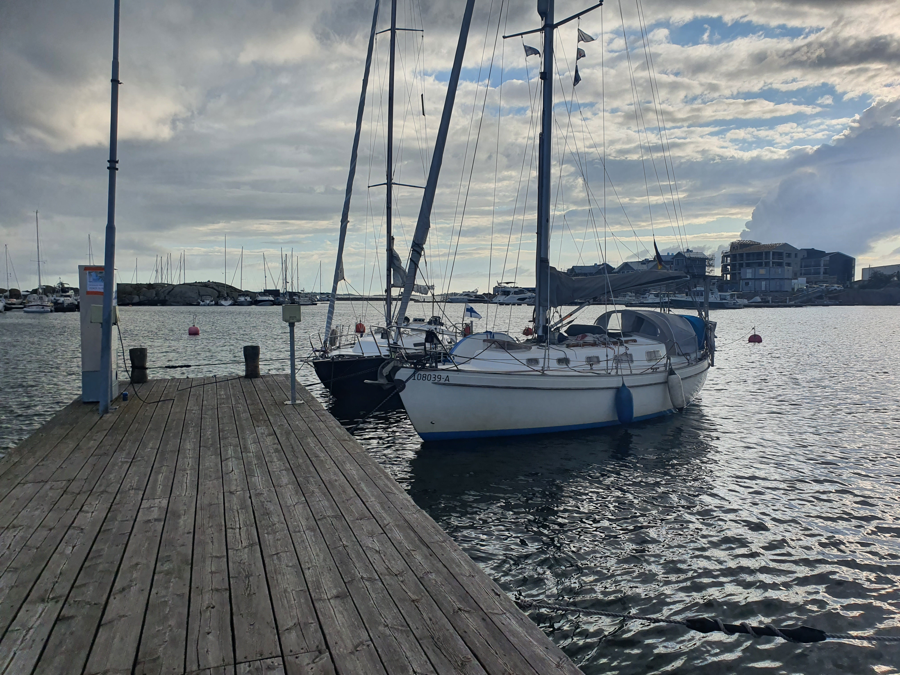
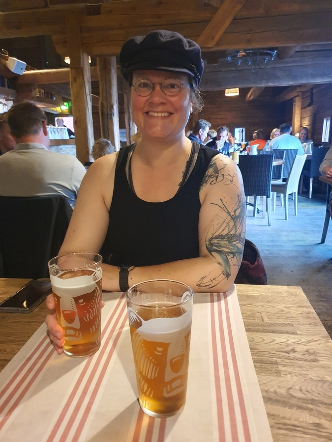

Two days passed leisurely on the island by picking berries, making food on the fire, and chatting with the other sailors. Now the day started with an early stop at Inkoo for an appointment. Then onwards into the rainy day!

The southerly winds funneled through the Barösund strait, so we ended up motoring it. Once the fairway got a bit wider, we were finally able to hoist sail. After a single tack the rest of the day was spent close reaching. As the wind changed between the islands, we had to switch a few times between the genoa and the staysail to keep moving efficiently.

 

Passing the island of Busö there was a sudden burst of activity, as we managed to jam the genoa sheet in the self-tailer. Suski had to disassemble and assemble the winch while maintaining a close-reached course in the rocky fairway. Some hassle and a bruised finger later, everything was back in order.

When we reached the Hanko fairway the sun came out, and we were able to enjoy an exhilarating beam reach with somewhat big waves. Lots of traffic coming against us as well. The local sailing season is about to end.

 

The main pier of Hanko was quite empty, and so it was easy to find a spot. Time for that long-awaited Classic Pizza and sauna, with an "anleger" sponsored by Andi. Thanks!

 

* Distance today: 41.2NM
* Total distance: 2208.4NM
* Engine hours: 3.5
* Dinner: pizza
