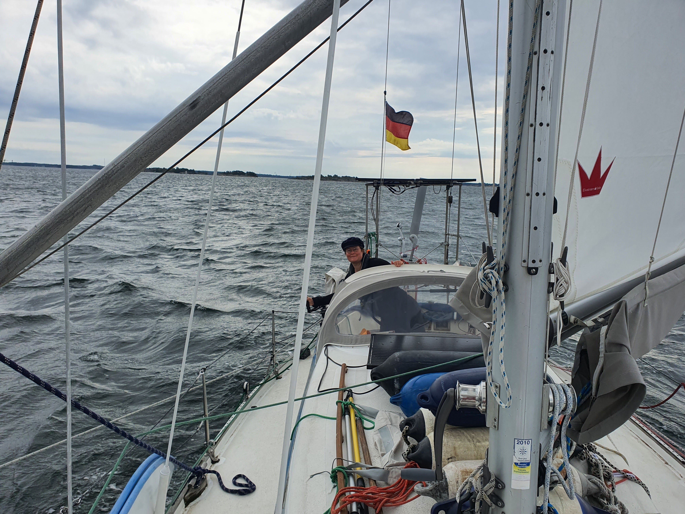
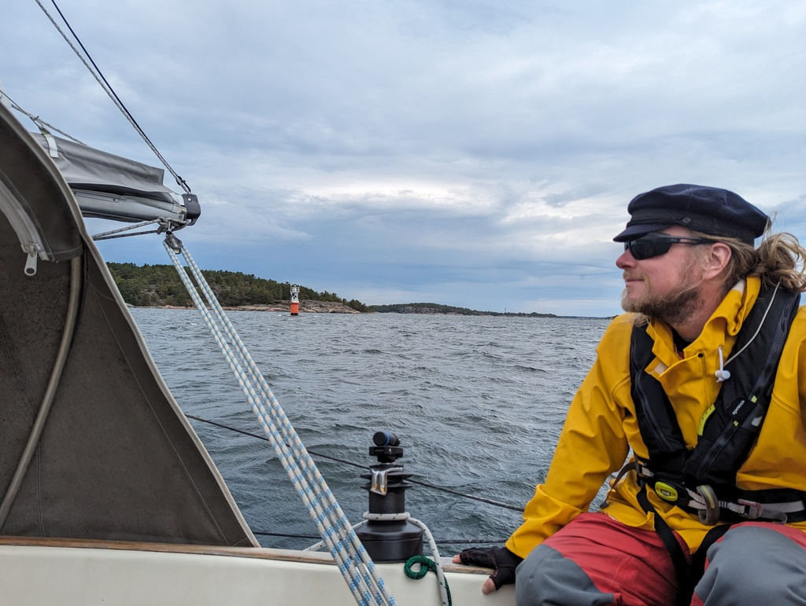
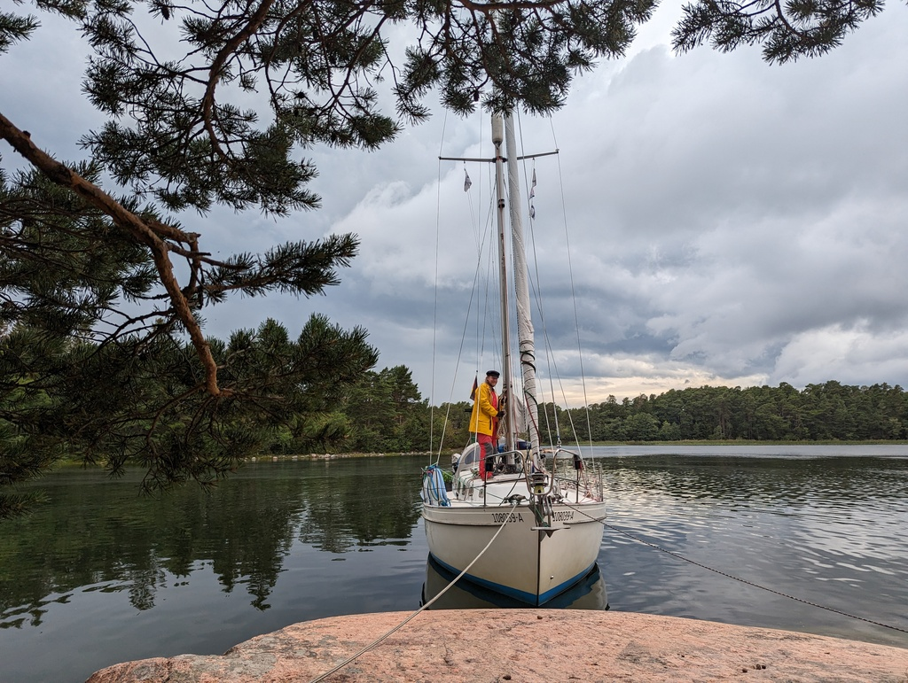

The start was planned to the timeslot when we expected the least wind. If we can plan ahead for a nice departure weather, we will do so. As the day promised some speedy sailing, we prepared the staysail on deck. Right outside of the harbour we hoisted our full mainsail and sailed with only that before our first gybe that followed some 15 minutes later. After the gybe we poled out our staysail and headed dead downwind on the narrow inner fairway west of Cape Hanko.

 

As the day grew older and the gusts were going over 25kn, we reefed the main. With less pressure for steering we glided forward. As the horizon grew darker and darker we decided to not go to our original planned destination but instead head to a nature harbour closer to our location. Sailing in a thunderstorm is not our preferred tactic. 

 

Benskär has couple of different options for scandic mooring and as we are the only boat in here, we could have our pick. Now we are tied to two big pine trees waiting for the rain to come. On the other side of the island we can here the waves crashing to the rocks and in our bay we have no wind. 

 

Tonight we start planning for the severe gale coming our way early next week. We are creating an itinerary of protected anchorages along the archipelago. Our plan is to place ourselves over the weekend strategically so that we have multiple options in hopes of choosing the one safe harbour that stays out of the way and cuts out 90% of the expected winds, as we did in Bockhamn.

* Distance today: 27.2NM
* Total distance: 2235.6NM
* Engine hours: 0.4
* Lunch today: Miisa's cous cous salad
