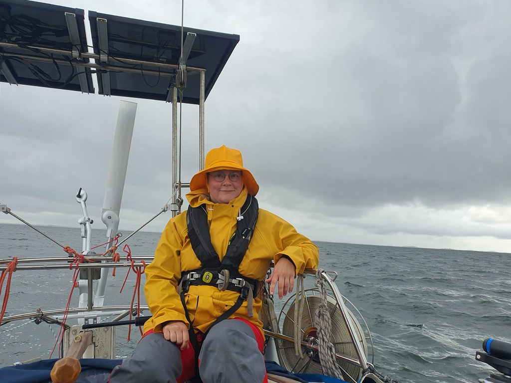
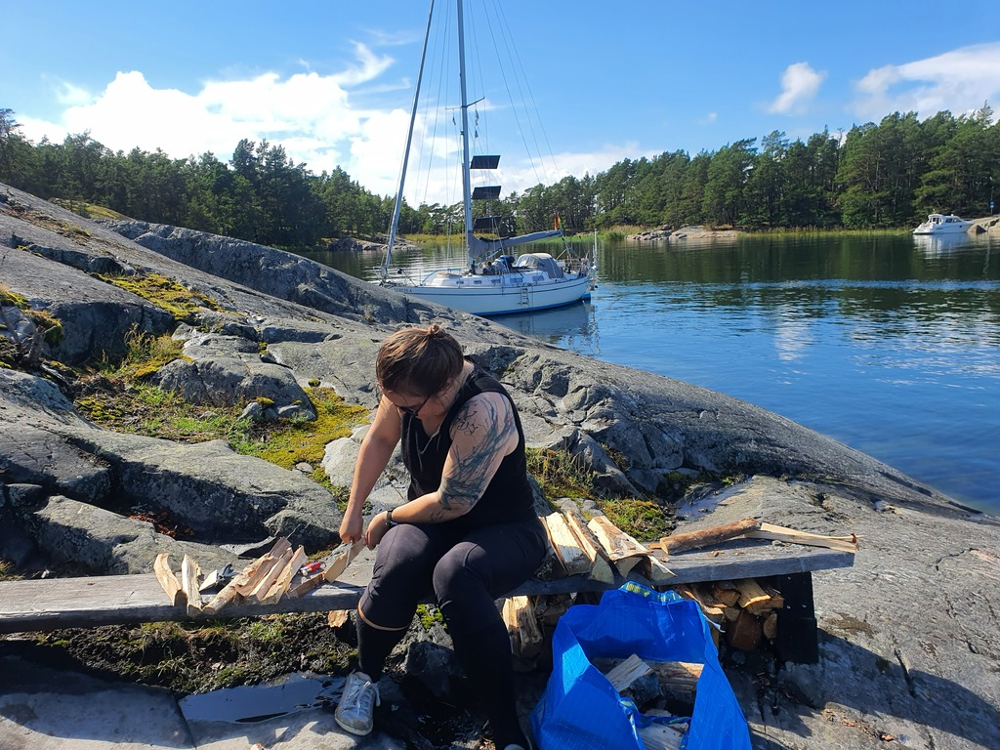

Today was just a short hop to the next nature harbour. That's the delightful thing about the Archipelago Sea - there are great places to visit every few miles.

 

The day started pretty grey, with occasional heavy showers. Wind was lighter than expected, and so we shook the reef we had set on departure pretty early on.

Nice mellow downwind sailing, then Scandinavian mooring at the next island, followed by some grilling at the fireplace. The sun came out as we landed, giving a nice boost to the boat batteries.

 

* Distance today: 10.1NM
* Total distance: 2245.7NM
* Engine hours: 0.4
* Lunch: grilled sausages
