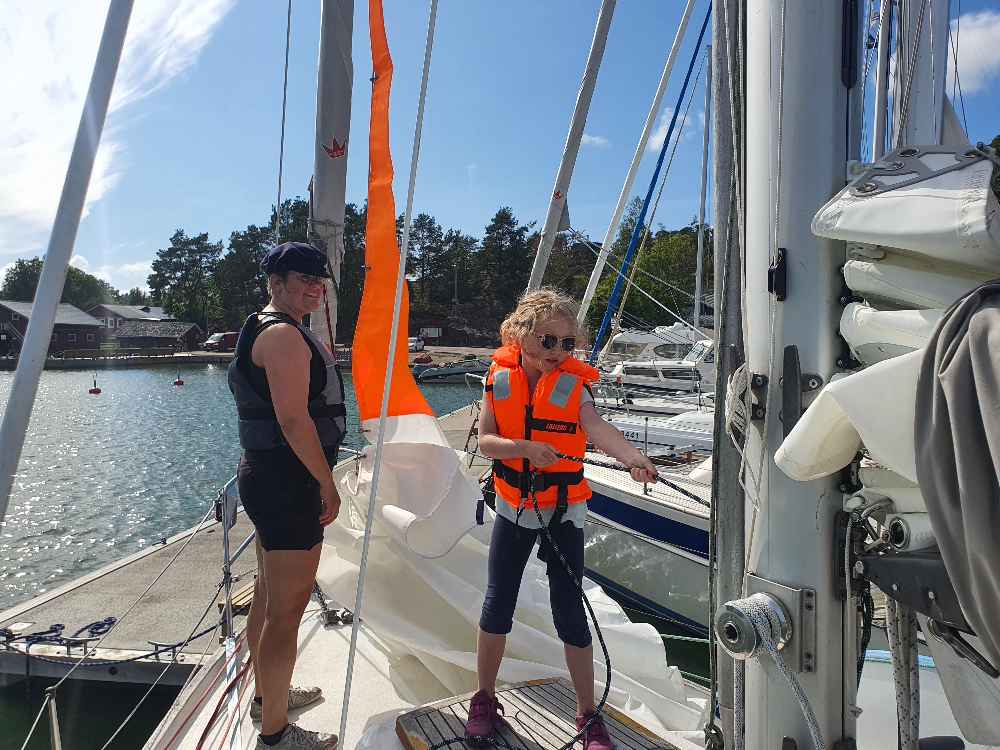

Today's forecast was pretty much perfect. Mostly sunny  with 10-15kt of wind. So not the worst opportunity to take some of the family sailing.

In the morning we hoisted anchor from the nature harbour, and headed for the marina at the town of Kirjais, conveniently reachable via the Archipelago Ring Road. We tied up, booked a berth for the night, and then after a brief playground detour headed out.

 

To get on all points of sail, we rounded the Gullkrona island group. As is often our style, the guests did most of the sailing, while we instructed and served lunch. Then back to the marina, some "anlegers", and more planning for what to do about the _"storm of the 2000s"_ as the press is styling it.

* Distance today: 20.3NM
* Total distance: 2266NM
* Engine hours: 1.1
* Lunch: spaghetti bolognese
