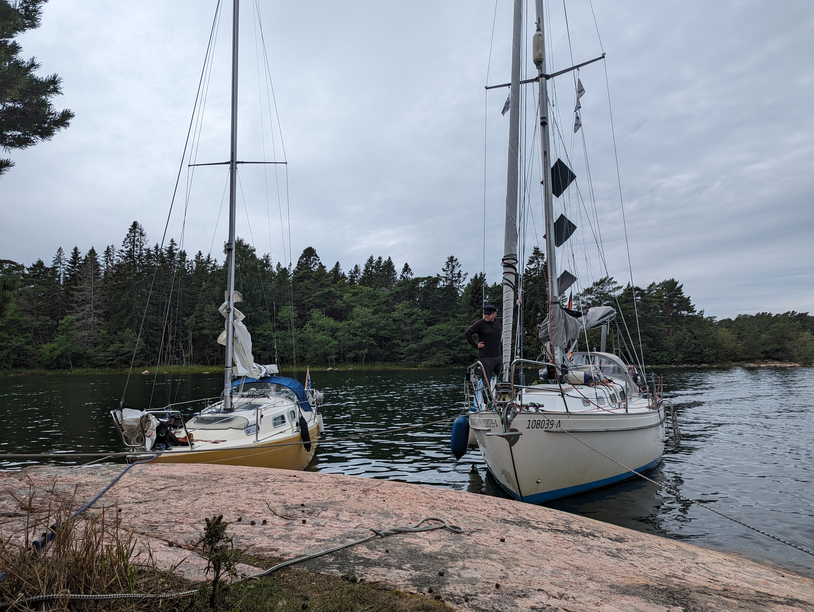

Our shelter for the storm has been chosen. We will stay in a bay in Södra Benskär. The island has a belt of tall rocks and thick pine trees covering them. This should be good for anything but NE and SW winds.

We started from Kirjais at 9 while still negotiating with ourselves what would we choose as our safe harbour. Tacking against a light easterly wind that came earlier than expected. So we checked all the weather models again. The broad "you will get everything from east to south to west" was now more precise and the worst is expected to be blowing from the south. So we made up our minds. 

We enjoyed a lovely beam reach with 10 to 13 knots of wind with practically no waves. Absolutely amazing sailing weather. A fair amount of other sailors were on their way to their chosen destinations. We approached our bay where we saw a yellow Marieholm sailboat tied to the same rock we were planning to use. A small negotiating later, we dropped our anchor on a slightly different angle thatn the marieholm and tied our bow to 2 big pine trees.

 

Now it's time to cook lunch and slide into island time.

* Distance today: 15.5NM
* Total distance:
* Engine hours:
* Lunch today: zucchini pasta
