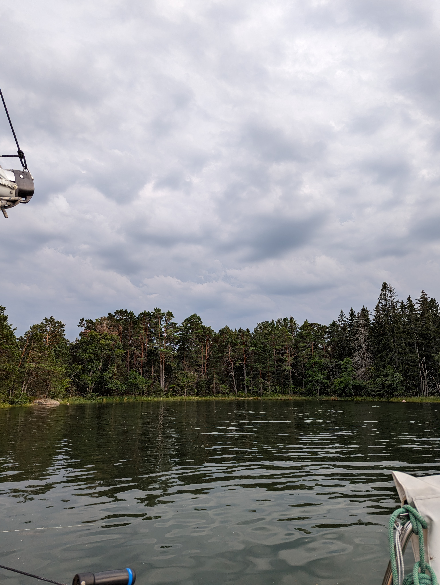
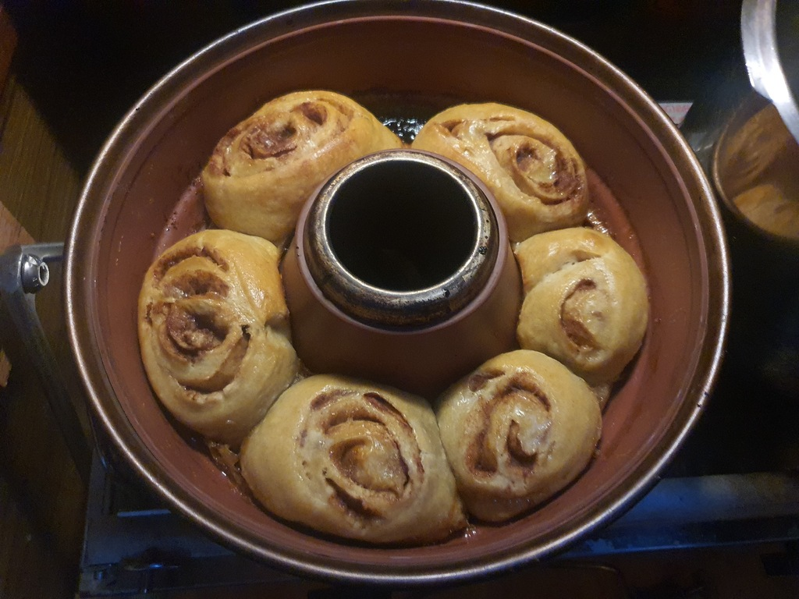
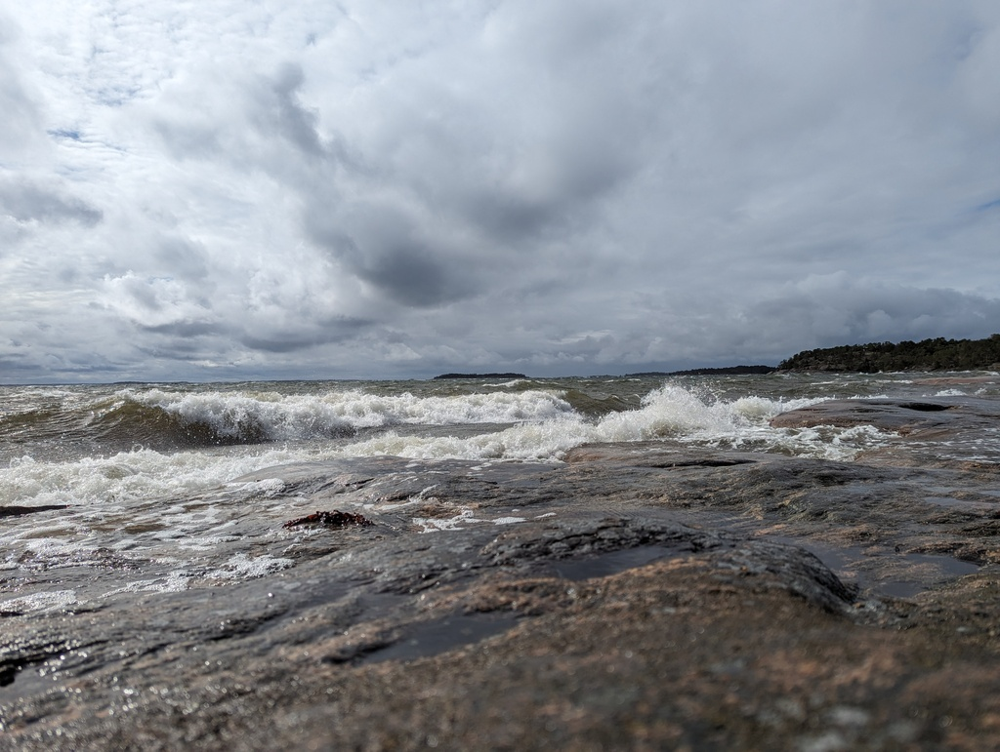

The storm Sylvia (Hans in Sweden and Norway) is over and we rode it out without much hassle.

Our chosen tactic was to search from the maps the most protected natural harbour. In our experience the nature harbours are tighter and more protected. This comes with pros and cons. Tighter quarters means that there is not much space for dragging, but  it also means wind has little space to gather it's forces. In tight quarters there is always the option to tie additional shore lines if the wind direction changes. Tight quarters means also that you need to plan ahead, there might only be space for 1 or 2 boats, so arriving late might mean that you need to find a new spot for yourself.

In Södra Benskär we shared our anchorage with one other boat. Before dropping the anchor and tying our shore lines we asked if he was happy to share the rock over the storm with us. As he was, we were also happy to be there. Having a great neighbour for a storm is a must. With additional eyes you can prevent and prepare better. Over the course of the storm the wind turned into south, which meant that the gusts hopping over the trees came to us directly from the beam. Both boats added a spring line to the shore trees. For us it needed to be a 60 meter monster passing from behind our neighbours stern. But that meant that we didn't budge an inch after the initial anchor dragging itself very very deep into the clay bottom.

The second most important tactic of ours after location is baking cinnamon rolls (korvapuusti). Baking keeps you occupied and stress levels down and in case something would go wrong at least you would have something sweet to eat. And if everything went fine, you had something sweet to eat!

During the storm our weather station was reporting a fraction of the winds the stations around were giving. Outside it was blowing 40-50kt, while the "big gusts" that reached us were around 25kt. So we could enjoy our time on the lee of the island and at times explore the stormy side with the knowledge that everything was fine with our vessel.

