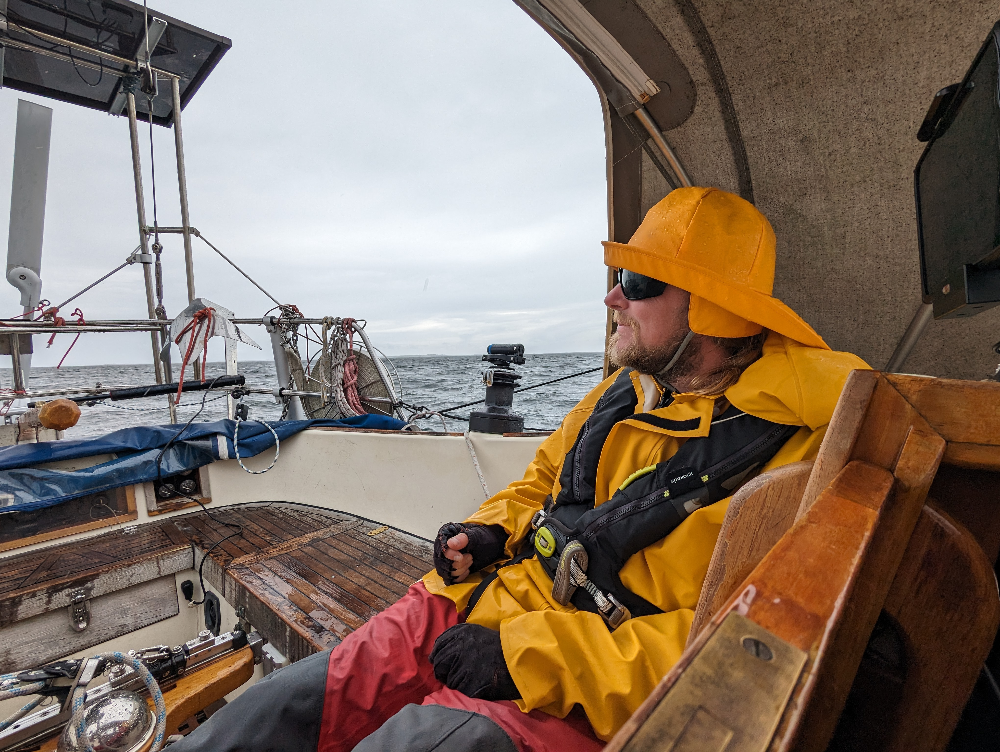
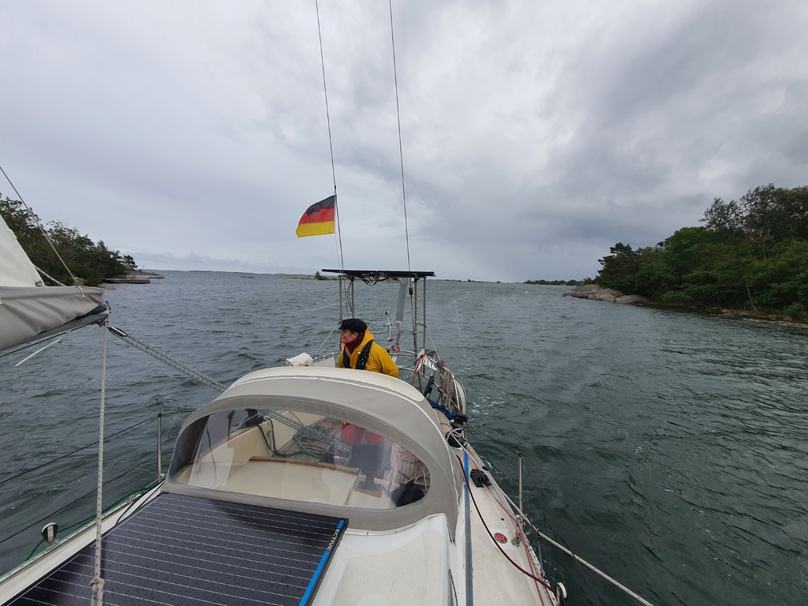

As the dawn broke the wind was howling in the masts of the sailboats in the harbour. Base wind of 22kt promised an interesting harbour departure. It is intimidating to go out when the wind howls in the masts, and a motorboat came in talking about "horrible conditions". Alas, out we went!

 

We hoisted the main in second reef and staysail and were cruising at 6 knots immediately with wing on wing. Rainshowers passed us multiple times during the day, so only one of us was outside and steering.

As we were making good speed, we used the hydrogenerator to power the watermaker and fill all of our available canisters with fresh water.

  

We arrived in Glada Laxen in the evening and were instructed by the harbour master to side tie to a Bavaria. Now we are enjoying the evening with friends who came here with their motor boat.

* Distance today: 40.2NM
* Total distance:
* Engine hours:
* Lunch: pea soup
