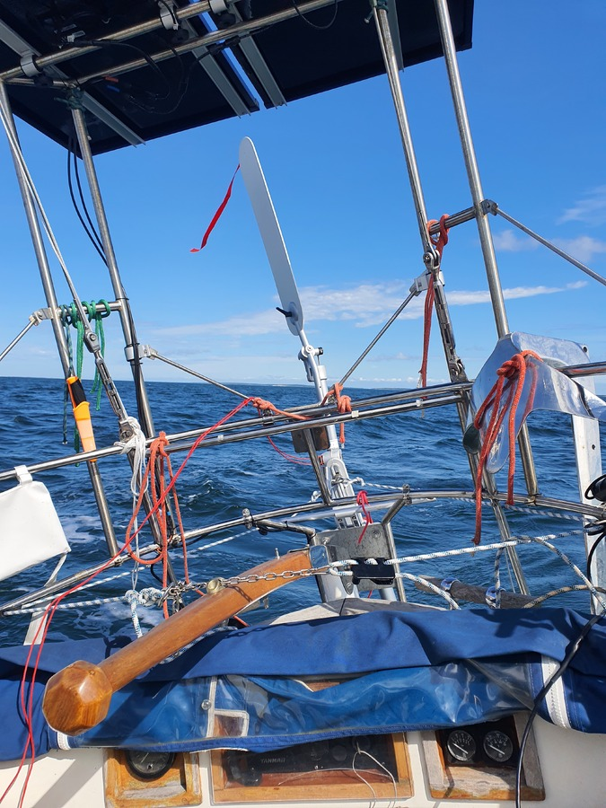

After enjoying the lovely fish restaurant of Glada Laxen, it was time to continue to the next point of interest in the Åland Islands.

We had turned the boat around with ropes already yesterday, making harbour departure easy. There was a somewhat strong wind and right on the nose, so we chose the combination of full main and the staysail.

 

The route turned out to be surprisingly pleasant after the initial spell of big waves that were stealing almost two knots of boat speed. We spent most of the day close-reached, having to do a couple of strategic tacks to navigate the rocky shores.

 

We crossed the ancient crater of Lumparn on a beam reach, steering with the windvane while we enjoyed lunch. Then we turned into the narrow fjord leading to the medieval castle of Kastelholm. We'll explore here for a bit with our the crew of our buddy boat, _Tuokio_.

* Distance today: 33.8NM
* Total distance: 2381.2NM
* Engine hours:
* Lunch: smoked salmon wraps
