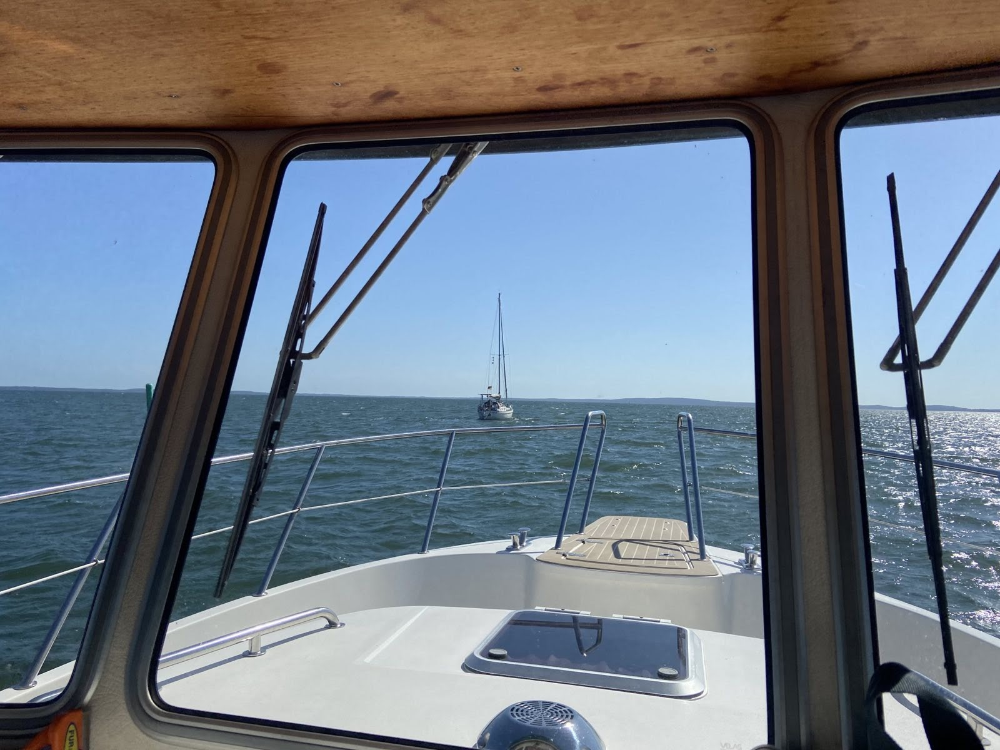
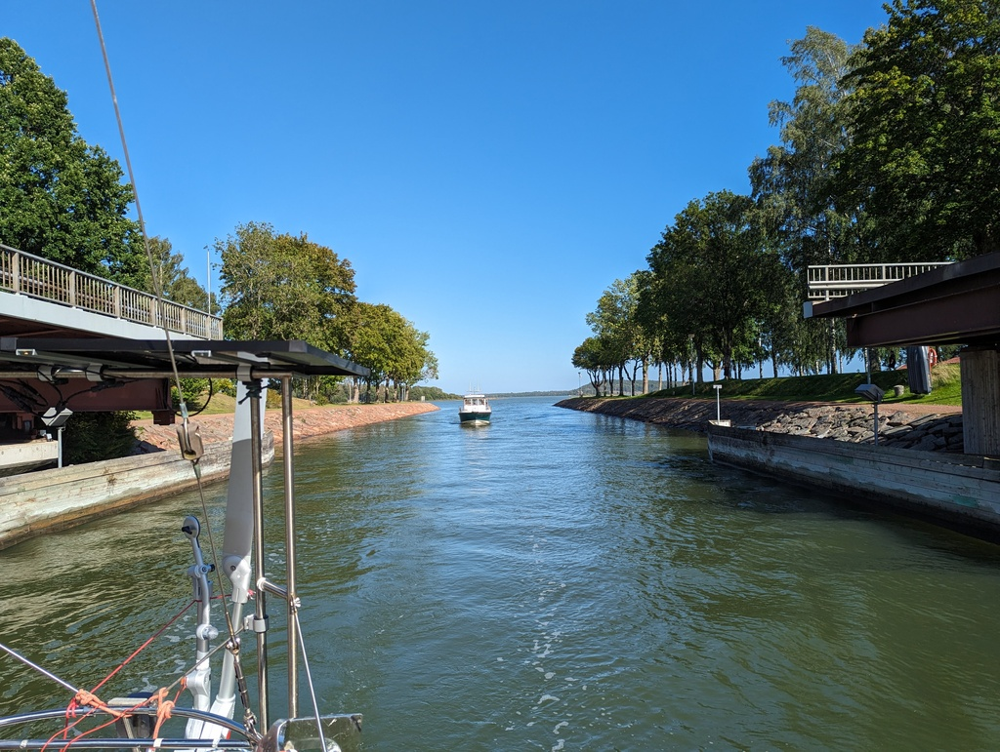

After visiting the Kastelholm castle and Taffel factory store it was time to find something new to see. As we had spent half of last night stargazing to enjoy the Perseid meteor shower we decided to head to town. 

 

Expected headwinds and buddy boating meant that we decided to motor the whole way together. The navigational difficulty of today was the Lemström canal with a turn bridge. The bridge opens every full hour for 10 minutes. We arrived about 20 min too early, so we proceeded to slowly drift the last mile towards the bridge.

 

After the bridge it was only few miles to the harbour. We tied to pilings in the harbour and we are ready for the sights of the city. The seafaring museum here is supposed to be excellent.

* Distance today:
* Total distance:
* Engine hours:
* Lunch today: Smakby restaurant's vegan lasagna and meatballs with mashed potatoes
