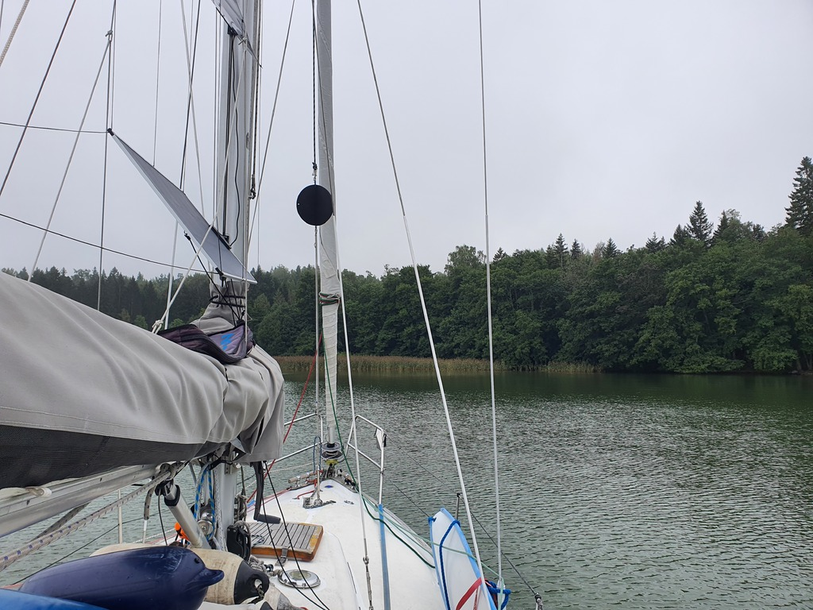

Having had a great time in the Ålands with the _Tuokio_ crew, it was time to think of the next move. As a very favourable wind shift is in the forecast, we decided to stage Lille Ø to an anchorage outside of Mariehamn and get the boat ready.

In a misty and windless day we motored the short hop to the Medieval anchoring bay of Norrhamn. Here we'll do some boat projects and get a bit of rest before a likely early start tomorrow.

 

* Distance today: 1.8NM
* Total distance: 2395.4NM
* Engine hours: 0.6
* Lunch: hamburgers
