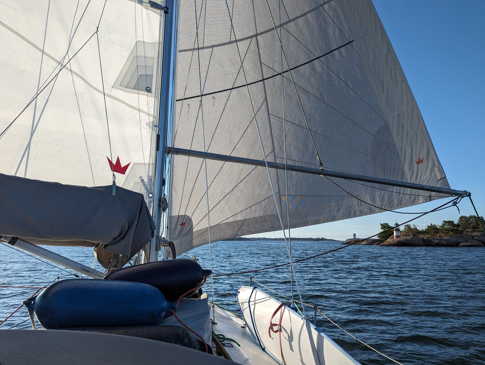
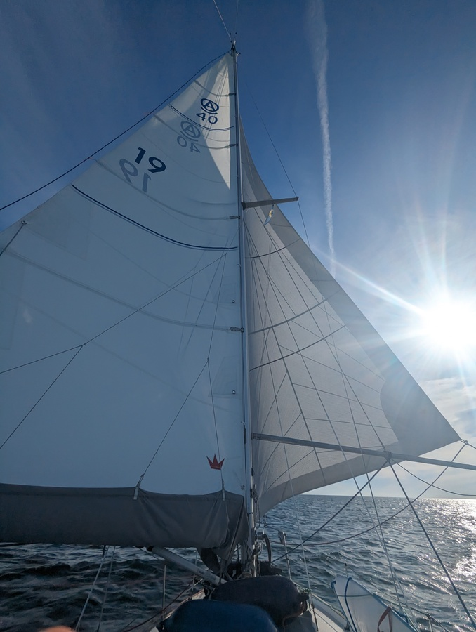

The long awaited northerly winds finally arrived and we set sail at the same time as the sun rose. We hoisted the anchor and packed it into the anchor chain locker so we don't have anything extra hanging from the bow in case of big waves. We glided between the islands like a ghost with no one else in sight. 

 

After passing the last of the inner islands the wind picked its steady around 17 knots pace and the moderate sea state means we are absolutely flying towards south. We crossed the main shipping lane at it's crossways and continue to straddle the line of Swedish territorial waters. 

 

As I write this it is the start of my second 6 hour shift. I'm prepared for the darkening evening with a thermos of hot tea and snacks. 

* Distance today: 60 NM
* Total distance: 2455.4 NM
* Engine hours: 0.3
* Lunch today: pea soup
