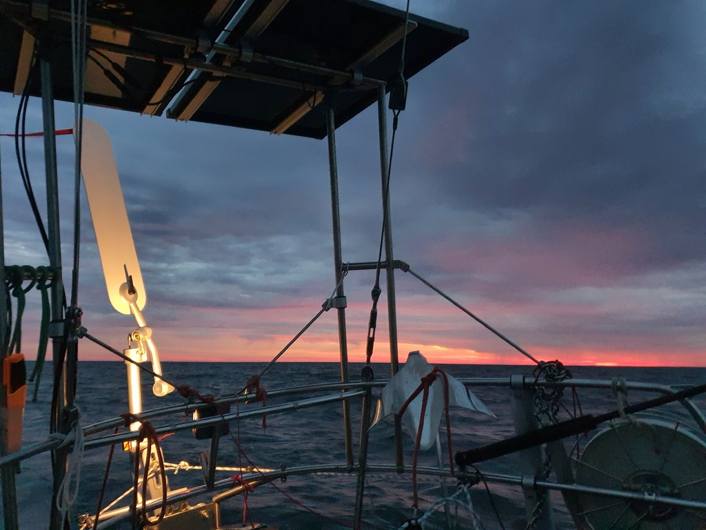
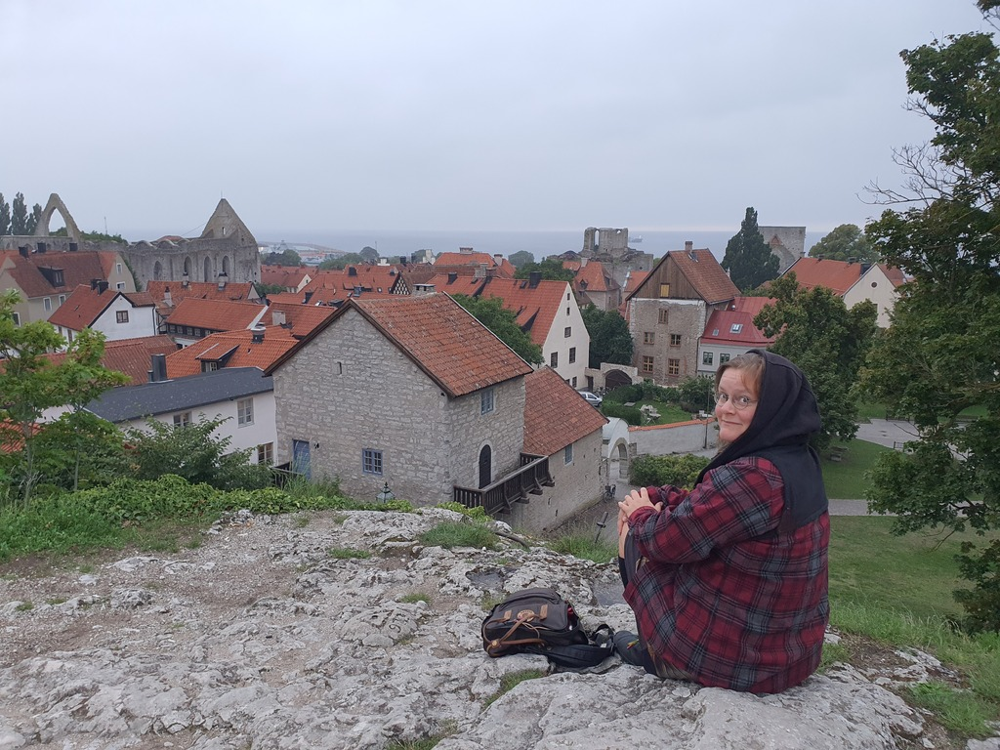
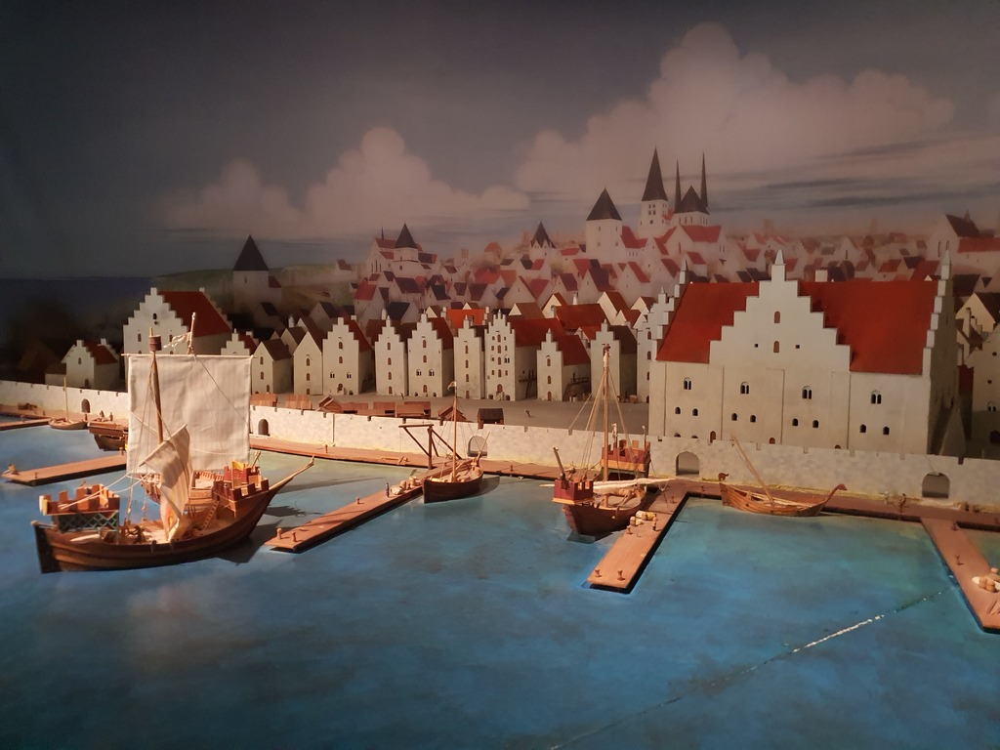

Night sailing was quite awesome. Clear skies giving views to some leftover Perseids, as well as Iridium flashes. This is something we didn't see during the white nights of the northern summer. There was some freighter traffic around, all giving us way politely.

In the morning things got a bit more tricky. The wind died, but the waves continued. This caused quite a lot of sails slamming, and eventually forcing us to motor for couple of hours until the wind picked up again. Highlight was a woodpecker that took a short break on our boom somewhere south of Gotska Sandön.

In the afternoon we were back on track, broad reaching with nice 15-20kt winds. Eventually we sighted the medieval walled city and pirate haven of Visby and picked a spot in the guest harbour. Since neither of us have been here before, it is time for some sightseeing!

* Distance today: 109.5NM
* Total distance: 2565NM
* Engine hours: 2.5
* Dinner: macaroni with feta and pesto
