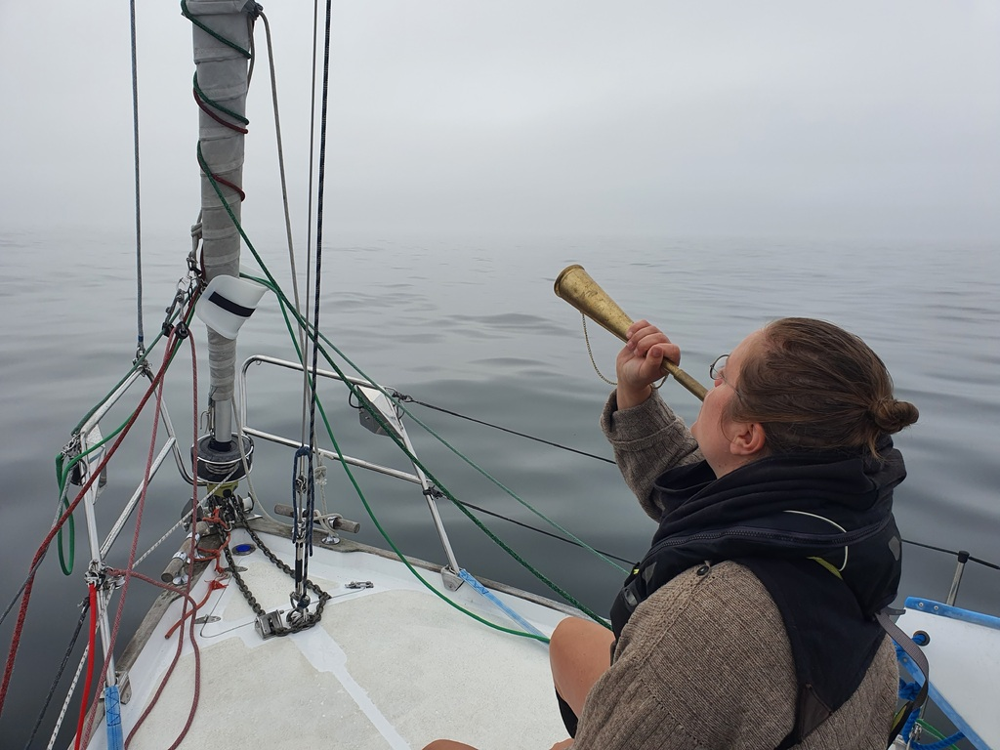

Sunday promised to be a slow day with the spinnaker up. We prepared everything already in the harbour and hoisted the spinnaker in its sock up already in the calm waters behind the wave breaker. As soon as we passed it, we hoisted the sock and were on our merry way towards west and mainland Sweden. 

 

As long as we had wind, it was nice and effortless sailing. Checking the traffic and reading books. We expected the wind to slowly die down towards the evening but weather had other plans. The wind died after some 20 nautical miles and we were forced to motor the rest of the way. In the end it became a blessing in disguise as all of a sudden a very thig fog covered us. We couldn't see more than 0.2 NM at times, so we promptly sounded a Suski-powered fog horn every 2 minutes.

 

Now we are again tied to a rock in the archipelago looking for a sunny day tomorrow charging our fairly depleted batteries.

 

* Distance today: 52.7NM
* Total distance: 2617.7NM
* Engine hours: 7.1
* Lunch: chanterelle risotto
