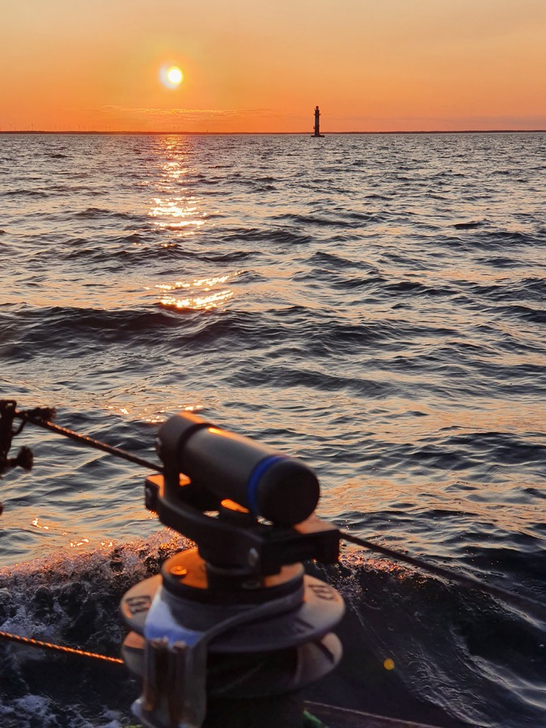

Having enjoyed some anchoring time, we wanted to capitalise on the forecasted good westerlies by sailing as far into Kalmarsund as possible. So, early start... With just a little issue. Overnight the water level had dropped, and Lille Ø was aground. With some combination of warping with the anchor, moving weight to bow, and using the engine we managed to pry ourselves loose and get under way.

 

Initially the going was really good. We were losing to the 50ft boat sailing the same direction, but reaching hull speed even while utilizing the hydrogenerator. There were thoughts of needing to reef.

But no, the wind dropped drastically as we got closer to Blå Jungfrun, and the wave period conspired to almost stop us completely. As the speed through water dropped, we had to switch from the windvane to the electronic autopilot, which promptly delighted us with a couple of unintended tacks with a `NO DRIVE` error (a new one!). Likely because the speed was too slow for the pilot to steer, but something to keep in mind.

Eventually the wind came back and we kept blasting along Kalmarsund on a beam reach. Around sunset we decided that we'd aim for the Kalmar guest harbour, as we know it well and it is lit well enough for a nighttime arrival.

 

Night sailing was fun as always. Stars, satellites, and using the sector lights to navigate. We had seen very little shipping during the whole day, but of course there appeared two freighters to deal with around the narrowest part of the Kalmar fairway near the bridge. AIS is certainly helpful in these situations!

* Distance today: 72.1NM
* Total distance: 2689.8NM
* Engine hours: 0.9
* Lunch: feta avocado salad
