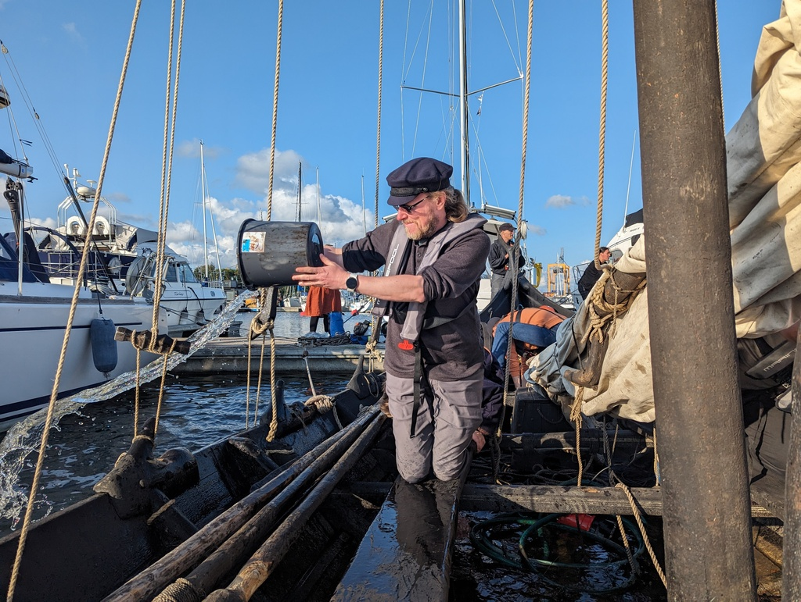
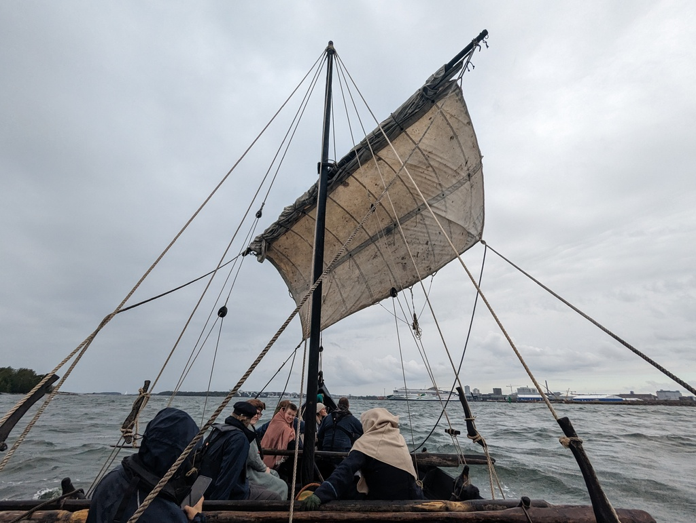
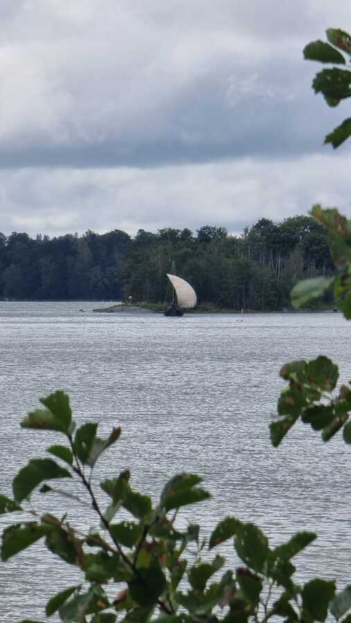

Life has its unpredictable nature and this time it served us a bitter deal with Suski's father passing away. We left the boat in Kalmar and came back to Finland to grieve and help organize the funeral. After a couple of weeks on dry land we were offered the chance to sail a replica of a real [Viking Age ship *Sotka*](https://www.viikinkiajanlaiva.fi/english/sotka-in-english) and we took it.

We arrived to the boat in Vuosaari around 18 and met with the captain and the crew. As the first task, we emptied all the water from the boat that had seeped or rained in, and packed everyones belongings to the bow and stern - the only properly dry places on board.  We were 14 persons for the Friday leg to Suomenlinna which meant that we could swap rowing positions along the route. After a briefing we got onboard and took the assigned seats. As there is no engine and we were facing direct headwind for the whole journey, it meant that we were going to row the whole 9.2 NM. Rowing with 5 pairs of oars meant that 10 persons were working, 1 steering and 3 were on break or responsible of the navigation.

As the crew had a mix of newbies like me or seasoned viking ship sailors like Bergie, the rowing got a bit of getting used to and to get the timing right for everyone. The starboard stermost oar is the pacing oar. This person is responsible of the speed and rythm of rowing that everyone needs to follow. The port side position 1 takes their rythm from the starboard one and everyone else follows the first oar on their side. A task much harder than you would think, especially when you add the sea swell into the mix.

We were making a good 2.2 knots of speed against the swell and 15 kn winds. After the first hour we started a rotating break plan. Starting from the first oars we took a rolling ten minute break. When the first pair was done, it was time to break for the second and then the third and fourth and finally the fifth pair. This way there is no need to stop completely and we could keep up the movement at all times. As the sun slowly set, we used a battery powered headlamp as our running light, after all, we were a mere rowing boat going about its business.

We tried to pass the Hevossalmi bridge during its opening time, but we missed it by only a minute. Instead of waiting for the next opening we simply lowered the mast, went under the bridge and lifted the mast back up. We approached Suomenlinna island fortress under the guidance of its lighthouse, dropped the mast again to save us an hour of rowing to get to the guest harbour.

To our suprise the harbour was very full and not a single spot for our boat size was available. So we squeezed ourselves in to a slightly too narrow and short boom mooring. As the hull shape gets narrower pretty quickly we submerged the booms low enough to fit. The poor fenders in between did not look happy at all!

As the rest of the crew took the ferry back to mainland we stayed onboard and spent the night on board Sotka under the starry sky.

Saturday started with the rest of the crew arriving at 7:20. We prepared the sail on second reef as the the gusts were blowing at 23 knots. After that was done, the captain gave us a sailing briefing and the harbour departure briefing. Suski got the spot of starboard first, so she got to choose the speed and pace. As we needed some space for hoisting the sails, we rowed the boat dead against the wind and the swell out of the harbour.

The more experienced crew hoisted the sail and we took a beam reach course towards our destination. As soon as the sail was up and we had gathered enough speed, the oars came in and most of the crew was instructed to sit on the windward side to balance the boat.

Sailing the square rig was very interesting and somehow a bit similar than sailing our big Parasailor (where the wing sort of operates as a yard). We were rocking 5 knots of speed in about a meter swell. The boat was performing absolutely perfectly! Suski was trimming the sheets and at times also the braces too. The bow section was in charge of the tack lines. Gybing was super simple and easy as you just needed to loosen one side brace, sheet and tack and tighten it on the other side.

For the Lauttasaari bridges we dropped the sail and mast and rowed under them. As the wind had already dropped and we were about to sail in the lee of Helsinki city center, we also opened the reefs from the sail and after hoisting the mast we pulled up the full sail.

We informed the iron age market of Pukkisaari of our arrival with the sounding of a signal horn (made out of a real horn!), and were greeted by multiple spectators on land. We dropped the sail quite near and rowed the rest of the way to our mooring. We set a stern anchor and tied the bow to the trees on shore. The adventure was over. What an amazing opportunity and fun it was! Thank you to both of the captains and our fellow crew.

Picture by Niklas Häggblom

* Distance Friday: 9.2NM
* Distance Saturday: 5.3NM
