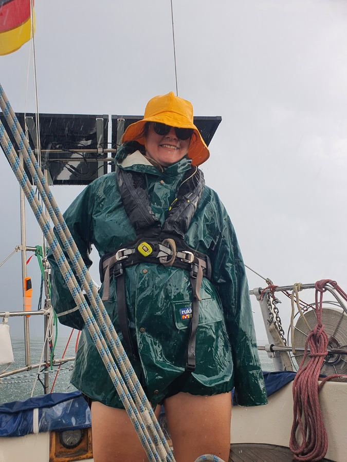

Back on the boat, and back on the water. We arrived from Finland to Kalmar late last evening, did a new provisioning round, and then left in the morning. The weather window towards south wasn't looking amazing, but this time of the year you take what's available.

Right out of the harbour we were greeted by the Danish royal yacht _Dannebrog_. They must have taken more photos of us than we of them, as we hoisted sail when motoring past them!

 

What followed was a day of slow tacking along the Kalmarsund. The forecasted nice sunny day turned out to be a series of thunderstorms. No matter, we kept plugging along.

Slightly before sunset the skies cleared, and as Weather Routing suggested, we were able to turn the boat to the course towards Bornholm and Poland. Let's see if the winds hold up for the night!

 

* Distance today: 38.5NM
* Total distance: 2728.3NM
* Engine hours: 0.4
* Lunch: cheese and vegetable wraps
