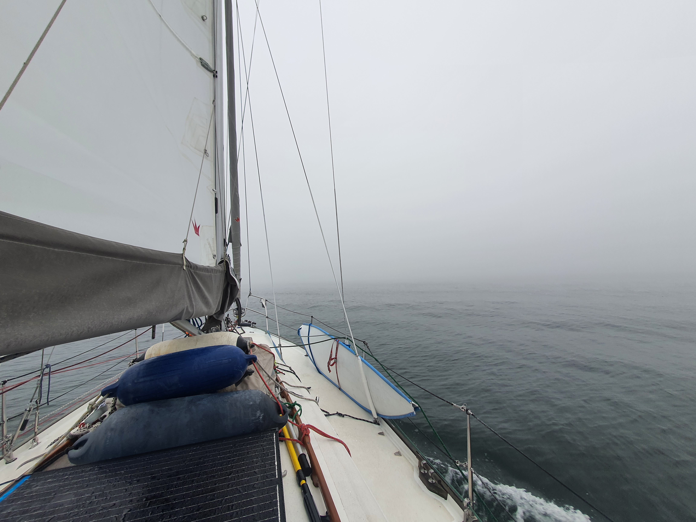
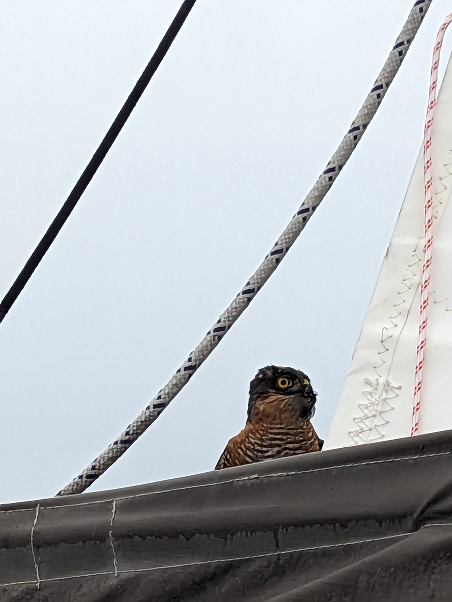

The night was dark. Only a thin sliver of moon, and very few lights around. Wind died around midnight, and as we were in the main shipping lanes, we elected to motor though them.

 

After a few false starts, wind returned at dawn. By now the sea state had quieted completely, and so we were able to sail with even just 3-4kt of wind, like you would on a lake. However, the other thing brought on by the dawn was a thick layer of fog. At times only a couple of boat lengths were visible. We proceeded cautiously using the fog horn and monitoring AIS.

There was a sudden invasion of small flies on all the exposed boat surfaces. These were followed by a flock of small birds that made the various booms and spreaders their home. Eventually a hawk appeared that caught one of the smaller birds, and proceeded to enjoy its lunch on the starboard spreader and on our lazy bag. Feathers everywhere!

 

Before our own lunchtime we entered Danish waters. Now we could get online briefly to download new weather, and to blog. Looks like the weather window towards Poland is still good.

* Distance today: 77.3NM
* Total distance: 2805.6NM
* Engine hours: 6.2
* Lunch: spaghetti bolognese
