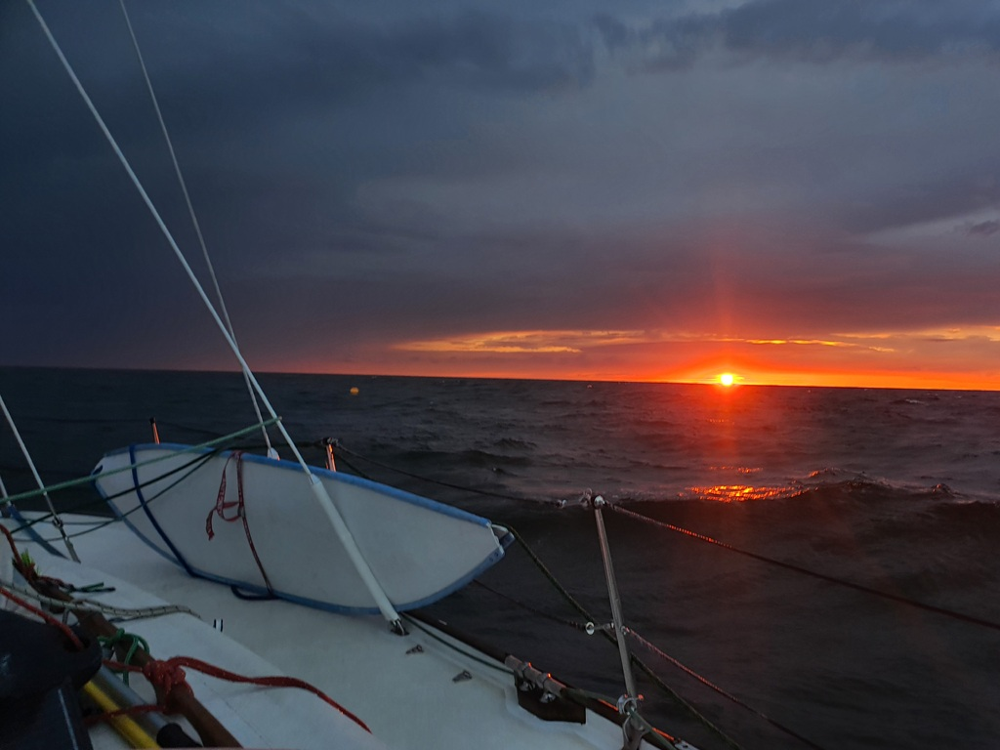
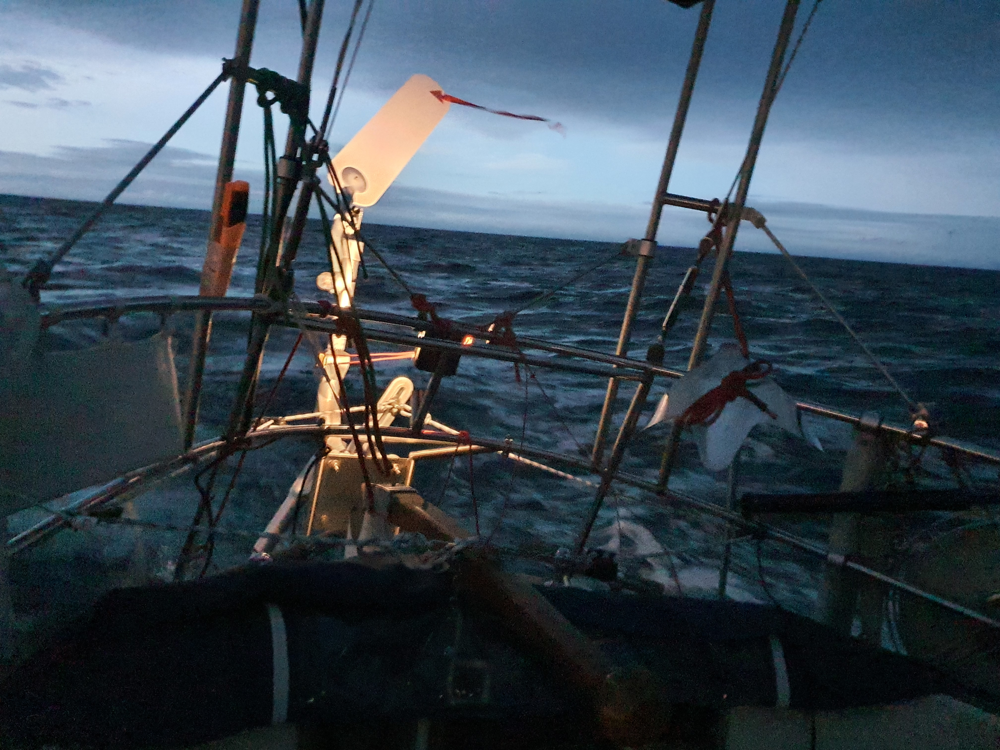

As we reached Bornholm, the winds we had been waiting for arrived. 15 to 20 knots, sometimes gusting to 25kn on the beam. Lille Ø was flying at hull speed and surfing down the fastly developing waves with 8 knots. We periodically reefed the genoa a bit to balance out the weather helm so that it would be easier for Starbuck (the wind vane). Other than that we could just sit and enjoy the ride.

As the night fell we got the corner of yet another raincloud but luckily the worst of it went past us. Rest of the night was spent gazing at the stars and the bioluminescent creatures blinking in our wake. For this night our green positional lamp had decided to dim itself into nearly non visible state, something we need to look at before our next evening of motoring.

Coming in at night is always exciting but we managed to find our way in and took the first available free spot right at the harbour entrance. This trip concludes our "Rund Rügen mit abstand" tour. In total 2753,9 NM at sea!

* Distance today: 81.7 NM
* Total distance: 2887.3 NM
* Engine hours: 0.4
* too early for lunch!
