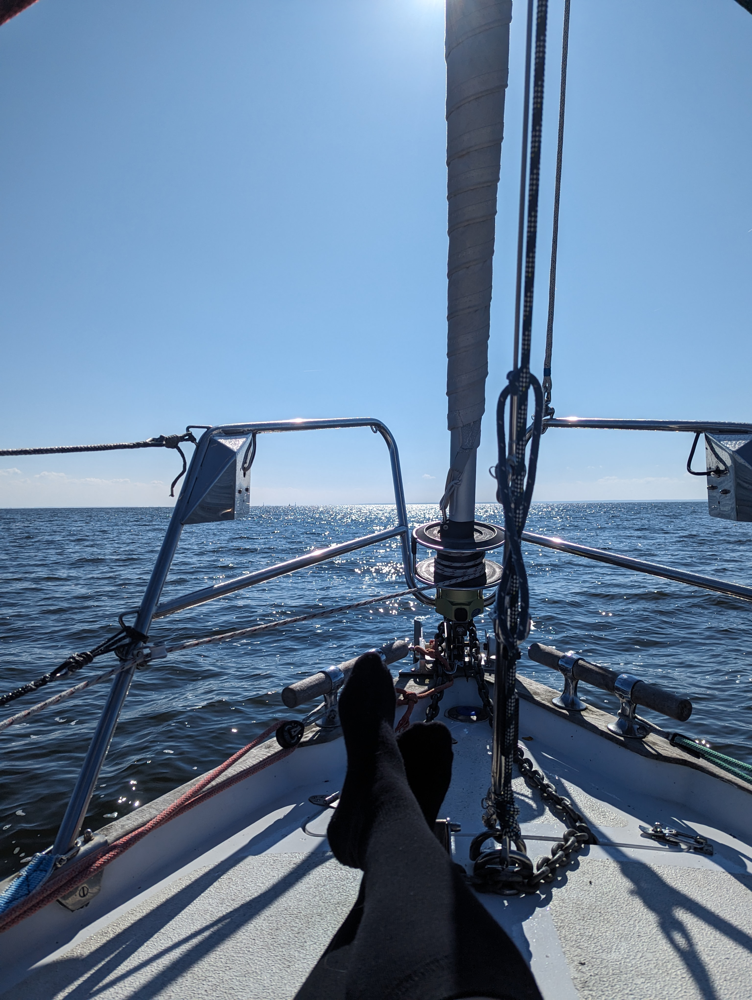
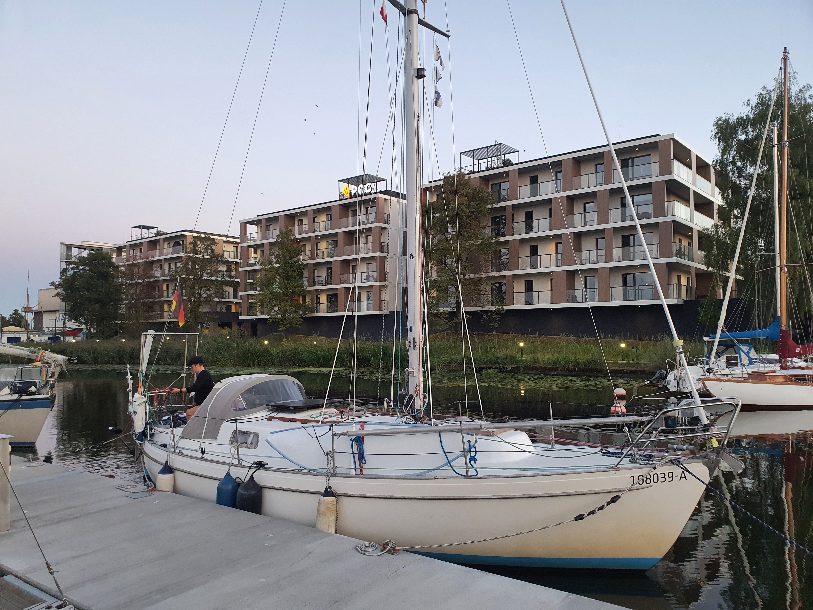

After a proper night's sleep, it was time to move on. We waited for the boat gas station to open at 9am so we could fill up for the long motoring back to Berlin. Then towards Szczecin.

Timings with the ferries worked perfectly, and the only moment of confusion was a tanker that turned sideways across the whole channel. They used the horn signals to tell us which way to go around, making the pass easy.

 

Wind on the Szczecin Lagoon was light and right on the nose, so we decided to just motor through. Suski was enjoying the sun on the foredeck, steering with the autopilot remote from there.

We found a spot on the dock at AZS without problems, and have the mast crane booked for early tomorrow. With that, we spent the remaining daylight getting the boat ready. Removing sails, boom, and the solar panels.

 

* Distance today: 37NM
* Total distance: 2924.3NM
* Engine hours: 8.7
* Lunch: potato bracioles
