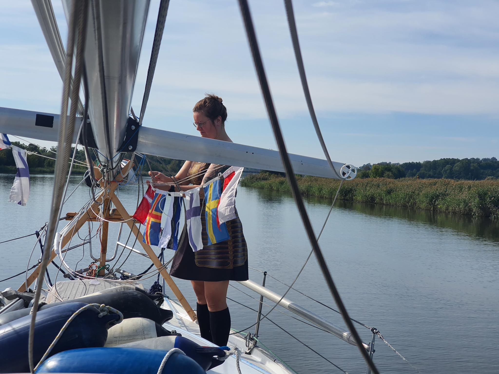
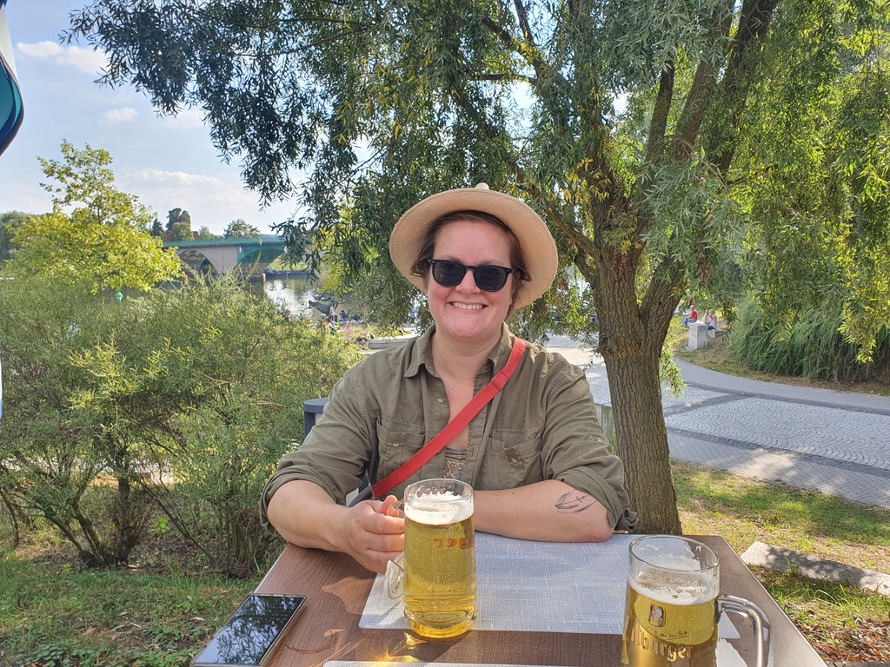

The morning started with practically no wind. As we are now a motor boat that didn't matter. We took off and headed towards West-Oder. As it is a Sunday there were quite a few people out on the water fishing.

 

As we reached Germany, we set up our row of courtesy flags in the order of countries visited.

We called ahead in to the Stroam Camping Schwedt to check weather there was availability in their guest moorings that are suitable for us. Luckily a spot with 1.8m depth was available, so we booked it. Now we are once again enjoying the territory of apfelschorle and radler!

 

* Distance today: 27.7 NM
* Total distance: 2952 NM
*  Engine hours: 5.7
* Lunch today: spydäri
