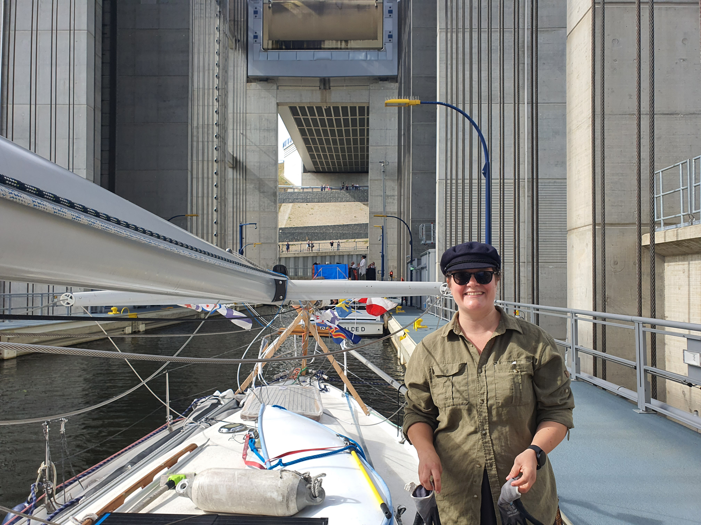

Some canal works closer to Berlin force us to pace our trip a little bit differently, as we'll need to pass a certain point tomorrow after 5pm. So today's project was motoring through the first locks and the ship elevator.

The morning went by with a quite leisurely motoring through the national parks of the Oder valley. Lots of birds but not much other wildlife this time.

 

At Hohensaaten we stopped at the sport boat pier and called the lock keeper. Quite promptly we were served out own private locking and were on our way. At Niederfinow ship elevator we got even luckier, as the lights turned green just as we arrived, and we were able to enter the new elevator right away. Then up 36m and onwards!

The canal works posed not much issue this time. We still radioed ahead to confirm how to pass one of the workboats. Then we pulled into the familiar marina of Marienwerder. We'll get a supply of fresh bread here before continuing tomorrow morning.

* Distance today: 35.6NM
* Total distance: 2987.6NM
* Engine hours: 7.6
* Lunch: Miisa's couscous salad
