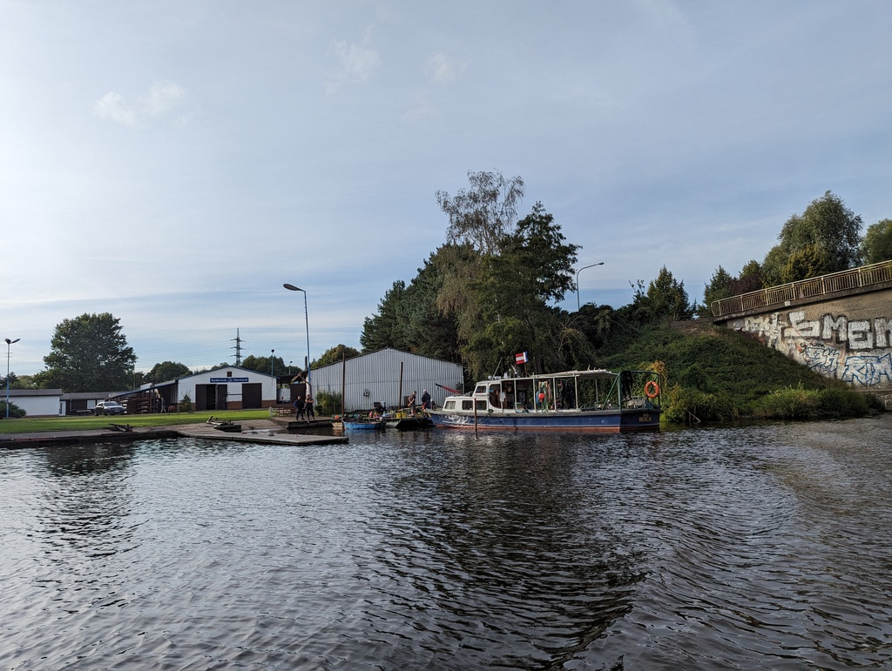

Morning started with a bit of a hassle. We had ordered breakfast buns, but the door they were behind was locked. So we drank the morning coffee, prepared for harbour manouvers and got the buns right as the harbour office opened. Then we glided off from the pier and turned our bow towards Lehnitz locks.

At the locks we needed to wait for about 30 minutes before being taken in for the ride down. After the locks it was time to find a spot to wait for the canal to be open again some 7NM away. We anchored at Lehnitzsee and enjoyed a nice peaceful lunch break followed by a nap. At 15:30 we started the engine again and paced ourselves so, that we were at the restrictions area 2 minutes before 17. The divers were already out of the water and drying their gear out as we passed. 

 

To try something new, we turned towards Tegeler See to check it out. We dropped our anchor at the side of the island of Scharfenberg and are now enjoying a quiet night. 

 * Distance today: 28.4 NM
 * Total distance: 3016 NM
 * Engine hours: 6.3
 * Lunch: Nettle pancakes
